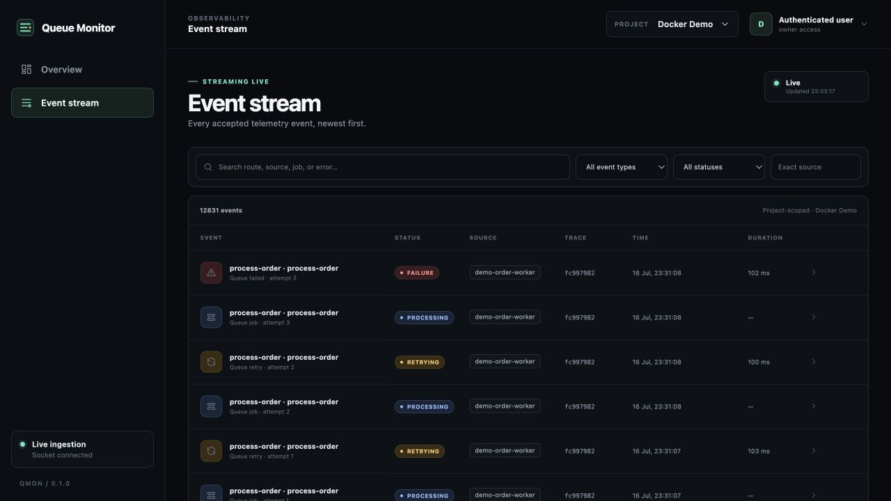
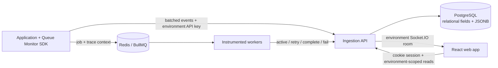
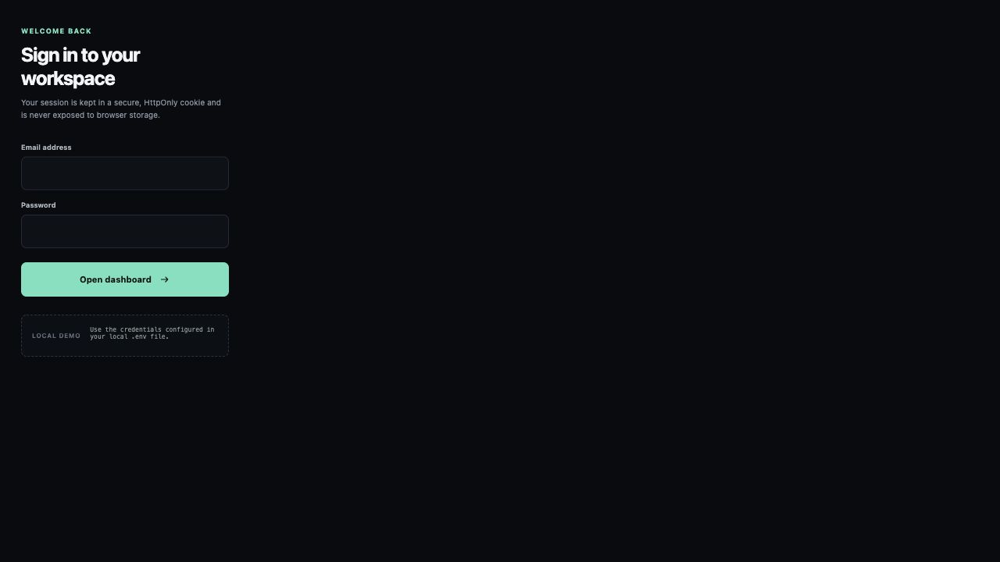
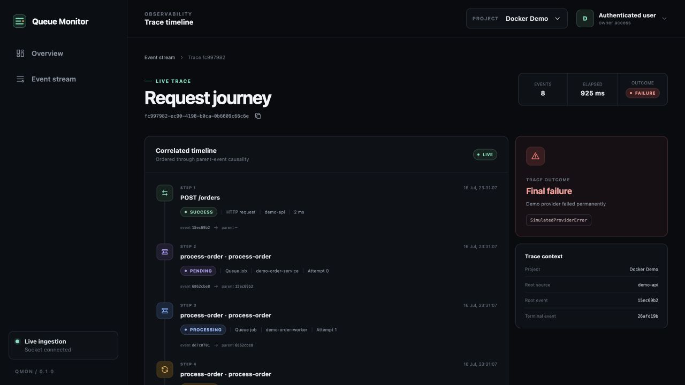

# Queue Monitor

Queue Monitor correlates one HTTP request with every BullMQ state transition it creates. The web app shows the request, queued/active states, retries, completion, and final provider error as one strictly environment-scoped live trace.



## Architecture



The tenant hierarchy is `Organization → Project → Environment`. Organization membership controls access, while API keys and every telemetry row belong to exactly one environment. The SDK injects `_monitor: { traceId, parentEventId }` into job data so every worker event points to its causal predecessor.

## Repository

```text
apps/
  api/          # ingestion, cookie/JWT auth, analytics, Socket.IO
  web/          # React overview, live stream, event details, trace timeline
  demo-service/ # Express + BullMQ order-flow example
packages/
  sdk/          # buffered client, Express/Fastify middleware, BullMQ adapter
  shared/       # event types and validation
infra/
  docker-compose.yml
```

## External developer quick start

Create an account at `http://localhost:5173/signup`, then use the in-app **Setup** checklist to create an organization, project, Production environment, and environment-scoped API key. The key is shown once.

```sh
npm install @queue-monitor/node
export QMON_API_KEY='qmon_live_...'
```

```ts
import { monitor } from "@queue-monitor/node";

monitor.init({
  apiKey: process.env.QMON_API_KEY,
  endpoint: "http://localhost:3000",
  service: "payments-api",
  environment: "production",
  redact: ["authorization", "password", "token", "cardNumber"],
});

monitor.capture({
  type: "http_request",
  status: "success",
  data: { method: "GET", route: "/health", statusCode: 200 },
});
```

Open **Event stream** in the same environment and inspect SDK health with `monitor.diagnostics()`. See the [complete SDK guide](packages/sdk/README.md) and [external beta guide](docs/external-beta.md).

## Local setup without Docker

Requires Node.js 20+ (CI uses Node 24), PostgreSQL, and Redis.

```sh
npm install
cp .env.example .env
```

Fill every required value in `.env`. Generate new local values rather than copying credentials from documentation:

```sh
openssl rand -hex 32                 # JWT_SECRET
openssl rand -hex 24                 # append to qmon_live_ for DEMO_API_KEY
```

Configure these values in `.env`:

```text
DATABASE_URL          PostgreSQL connection URL
JWT_SECRET            at least 32 random characters
DEMO_LOGIN_EMAIL      web demo account
DEMO_LOGIN_PASSWORD   at least 12 characters
DEMO_ORGANIZATION_*   seeded organization name and slug
DEMO_PROJECT_*        seeded project name and slug
DEMO_ENVIRONMENT_*    seeded environment name, slug, and type
DEMO_API_KEY          qmon_live_ plus a random value
QMON_API_KEY          same value as DEMO_API_KEY for the demo service
APP_URL               public web origin used in invitation links
SMTP_*                optional SMTP delivery; omit to copy invite links in-app
```

Then run:

```sh
set -a
source .env
set +a

npm run db:migrate
npm run db:seed
npm run dev
```

Open:

```text
Web app       http://localhost:5173
API           http://localhost:3000
Demo service  http://localhost:3001
```

Use the login values from your local `.env`.



## Docker setup

On a Docker-capable machine:

```sh
cp infra/.env.example infra/.env
```

Replace every placeholder in `infra/.env`, then start the complete stack:

```sh
npm run infra:stack:up
```

Open `http://localhost:4173`. PostgreSQL, Redis, API, demo service, and web app run as five services. Stop them with `npm run infra:down`.

Neither `.env` nor `infra/.env` is committed.

## Migrations and deployment

Migrations are ordered, checksummed, and recorded in `schema_migrations`. Run them as a single pre-deployment job, before increasing API replicas:

```sh
npm ci
npm run build
npm run db:migrate
npm run db:migrate:validate
npm run start
```

Deploy the API and demo service with `NODE_ENV=production`, `HTTPS_ENFORCE=true`, `COOKIE_SECURE=true`, release metadata (`APP_VERSION`, `GIT_COMMIT_SHA`, `BUILD_TIMESTAMP`), and secrets from a managed secret store. Put the API behind a trusted TLS load balancer, restrict PostgreSQL/Redis to private networks, and use `/health` for liveness and `/ready` for traffic admission. Read the [security architecture](docs/security.md), [production operations and disaster recovery runbook](docs/operations.md), [billing-meter contract](docs/billing.md), and [manual security test guide](docs/manual-security-testing.md) before production rollout.

### Upgrade notes from 0.1 project tenancy

Migration `002_multi_tenant_environments.sql` preserves existing data by creating one organization and one Development environment for each existing project, moving memberships to the organization, and moving API keys/events to that environment. The intentional API changes are:

- the React application now lives in `apps/web` as workspace `@queue-monitor/web` and runs with `npm run dev:web`;
- telemetry reads now require the environment-scoped `x-environment-id` header;
- key creation accepts an environment UUID instead of a project UUID;
- the old `viewer` role is migrated to `member`;
- the allowed browser origin is configured with `WEB_ORIGIN`.

These changes are required to prevent production and development telemetry from sharing a query/key boundary.

Migration `003_external_beta.sql` converts `events.trace_id` from UUID to text so existing UUIDs and W3C 32-character trace IDs coexist, maps `member` to `developer`, expands roles to Owner/Admin/Developer/Viewer, and adds invitations plus onboarding progress. It does not rewrite or delete telemetry.

Migration `004_security_saas_operations.sql` adds persistent sessions/password resets, immutable audit evidence, subscription plans and usage ledgers, exact retained-storage accounting, transactional rate-limit buckets, organization/environment security policy, and status/maintenance records. Existing organizations receive the Free plan and its security/storage rows. Existing browser JWTs intentionally require one new login because persistent session IDs are now mandatory.

Migration `005_demo_workspace.sql` marks dedicated demo organizations, environments, users, and internal keys. Demo session claims are read-only at the API boundary, and internal generator keys are excluded from dashboard key lists and exports.

## CI and security checks

GitHub Actions runs install, ESLint, formatting verification, typecheck, unit/integration tests, production builds, fresh PostgreSQL migrations, migration invariants, secret scanning, and `npm audit --audit-level=critical` on every push and pull request. Pull requests also use GitHub Dependency Review.

Run the same checks locally:

```sh
npm run lint
npm run format:check
npm run typecheck
npm test
npm run build
npm run security:secrets
npm run security:audit
```

## Demo scenarios

### Populated read-only demo workspace

The Phase 2.5 workspace uses a dedicated `Demo Organization → Demo Project → Demo Environment` and a separate viewer account. The seed command generates its password and internal ingestion key into the ignored local `.env`; neither secret is printed. The key is marked internal and never appears in dashboard key lists or exports.

```sh
npm run db:migrate
npm run demo:seed-account
```

Restart `npm run dev` after seeding so the BullMQ demo service adopts `DEMO_SEED_API_KEY`, then generate history through the real ingestion API:

```sh
npm run demo:generate
```

The deterministic fixture contains 1,230 events over the previous 30 days: 735 HTTP requests, 100 successful order traces, 25 retry traces, and 10 final-failure traces across `orders-api`, `payment-worker`, `notification-worker`, `order-processing`, and `notifications`. Rerunning generation produces duplicates rather than duplicate rows.

Sign in with `DEMO_VIEWER_EMAIL` and `DEMO_VIEWER_PASSWORD` from `.env`. The viewer can inspect overview metrics, events, details, and traces, but the API rejects administrative and destructive methods. Settings navigation is hidden.

Reset only the dedicated demo environment and its isolated usage ledger, then regenerate:

```sh
npm run demo:reset
```

During a presentation, create and validate a fresh eight-event BullMQ failure trace:

```sh
npm run demo:live-failure
```

The reset command verifies the environment belongs to `demo-workspace` and refuses to run if that organization contains another environment.

### Individual order scenarios

```sh
curl -s http://localhost:3001/orders \
  -H 'content-type: application/json' \
  --data '{"behavior":"success"}'

curl -s http://localhost:3001/orders \
  -H 'content-type: application/json' \
  --data '{"behavior":"retry"}'

curl -s http://localhost:3001/orders \
  -H 'content-type: application/json' \
  --data '{"behavior":"failure"}'
```

Expected final-failure sequence:

```text
HTTP request → queued → active → retry → active → retry → active → final failure
```



Database-backed acceptance checks:

```sh
npm run demo:validate -- success
npm run demo:validate -- retry
npm run demo:validate -- failure
```

## Measured 1,000-scenario load test

Run the repeatable benchmark while the local stack is active:

```sh
set -a
source .env
set +a

LOAD_TOTAL=1000 \
LOAD_CONCURRENCY=25 \
LOAD_TIMEOUT_SECONDS=240 \
npm run demo:load
```

Measured on the single-machine development stack on 2026-07-16:

| Metric | Result |
|---|---:|
| Orders accepted | 1,000 / 1,000 |
| HTTP acceptance throughput | 3,583.03 orders/s |
| Events expected / recorded | 5,998 / 5,998 |
| Event completeness | 100% |
| Average ingestion latency | 46.09 ms |
| P95 ingestion latency | 101.44 ms |
| Sustained event write throughput | 116.74 events/s |
| End-to-end completion time | 51.81 s |
| Expected business failure rate | 33.3% |
| HTTP request error rate | 0% |
| Missing parent events | 0 |
| Sample indexed trace query | 0.8 ms |

The workload contained 334 success, 333 retry, and 333 final-failure orders. PostgreSQL held 12,885 total event rows after the run; the cumulative `events` table plus indexes used about 10.66 MiB. Submission throughput is intentionally higher than worker completion throughput because `POST /orders` returns after enqueueing, while four workers execute simulated provider calls and retries in the background.

See [the full benchmark record](docs/load-test.md) for methodology and database observations.

## Two-minute demo script

**0:00–0:20 — Login**

Open the web app and sign in with the credentials configured in `.env`. Point out that the JWT is stored only in an HttpOnly cookie and the selected environment is revalidated through organization membership on every API and socket request.

**0:20–0:40 — Trigger a final failure**

Keep Event stream open and run:

```sh
curl -s http://localhost:3001/orders \
  -H 'content-type: application/json' \
  --data '{"behavior":"failure"}'
```

**0:40–1:00 — Show the live event**

Show the event stream updating without a browser refresh. Explain that polling is the fallback and Socket.IO provides the immediate project-room notification.

**1:00–1:25 — Open the trace**

Open the final `queue_failed` event and choose **Open full trace**. Highlight the same trace ID across the original `POST /orders`, queued job, and every worker attempt.

**1:25–1:50 — Explain retries and provider error**

Walk through queued → active attempt 1 → retry → active attempt 2 → retry → active attempt 3 → final failure. Point out that each `parentEventId` links to the preceding event and that the final card preserves the simulated provider error name and message.

**1:50–2:00 — Close**

“Telemetry delivery is buffered and non-blocking, PostgreSQL enforces per-project idempotency, and the UI remains useful through polling even when real-time delivery is unavailable.”

## Scaling evolution

| Stage | Evolution | Why |
|---|---|---|
| 1. Current | Stateless ingestion API writes validated batches directly to PostgreSQL | Simple operation and transactional idempotency for the interview-scale workload |
| 2. Scale ingestion | Run multiple ingestion API replicas behind a load balancer | Horizontal HTTP capacity; API-key lookup and validation stay stateless |
| 3. Add broker | Publish accepted envelopes to Kafka, NATS, or managed queues before storage | Absorbs bursts, adds backpressure, and decouples client latency from database writes |
| 4. Background consumers | Consumer groups normalize, enrich, persist, aggregate, and publish live updates | Independent scaling, retries, dead-letter handling, and controlled database concurrency |
| 5. Partition storage | Time-partition raw events by day/month and project; apply retention policies | Faster bounded scans, cheaper deletion, and predictable index sizes |
| 6. Aggregate reads | Maintain hourly/daily metrics tables or a columnar analytics store | Overview charts avoid scanning raw telemetry while trace lookup retains relational causality |

At higher volume, the data path becomes:

```text
SDK → ingestion API replicas → durable broker → consumer groups
    → time-partitioned raw events
    → pre-aggregated metrics / columnar analytics
    → environment-scoped read API and live gateway
```

## Security and configuration

- Runtime credentials exist only in ignored `.env` or `infra/.env` files.
- Committed `.env.example` files contain blank values or non-runnable placeholders.
- The seed script uses parameterized environment values; no demo password or API key is embedded in SQL.
- Docker Compose requires environment values and contains no database URL, JWT secret, password, or API key.
- The browser never receives the JWT; login sets an `HttpOnly`, `SameSite=Lax` cookie backed by a persistent, expiring, revocable session record.
- Only the non-secret selected environment ID is stored in browser storage.
- Ingestion API keys are stored as SHA-256 hashes and are shown only when created.
- No secrets use a `VITE_` prefix or enter the web bundle.
- The API enforces configurable request/event/batch/depth limits, organization/environment/key token buckets, monthly plan quotas, server-side PII/secret redaction, optional Business IP allowlists, and per-organization retention.
- Security-sensitive actions append to a database-immutable audit log. Exports omit all key/hash secrets; destructive endpoints require typed confirmation.
- Set `HTTPS_ENFORCE=true`, `COOKIE_SECURE=true`, and correctly scoped `TRUST_PROXY=true` behind production HTTPS; rotate every demo value before deployment.
- Daily backups are client-encrypted with `age`, stored with SSE-KMS, verified, failure-alerted, and restored monthly into an isolated drill database.

## Tenant management and telemetry APIs

Management calls require the HttpOnly session and an organization role. Owners/admins manage projects and environments; owners/admins/developers manage API keys; viewers are read-only. Telemetry reads require `x-environment-id`; the API resolves the environment through its project and organization before running any query.

```text
POST /v1/organizations
GET  /v1/organizations
GET  /v1/organizations/:organizationId/usage
GET  /v1/organizations/:organizationId/audit-logs
GET/PATCH /v1/organizations/:organizationId/security
GET  /v1/organizations/:organizationId/export?format=json|csv
DELETE /v1/organizations/:organizationId/telemetry
DELETE /v1/organizations/:organizationId
POST /v1/organizations/:organizationId/projects
GET  /v1/organizations/:organizationId/members
PATCH/DELETE /v1/organizations/:organizationId/members/:memberId
GET/POST /v1/organizations/:organizationId/invitations
DELETE /v1/organizations/:organizationId/invitations/:invitationId
GET/POST /v1/invitations/:token[/accept]
GET/PATCH /v1/organizations/:organizationId/onboarding
GET  /v1/projects/:projectId/environments
POST /v1/projects/:projectId/environments
GET  /v1/environments/:environmentId/api-keys
POST /v1/environments/:environmentId/api-keys
DELETE /v1/environments/:environmentId/api-keys/:apiKeyId
PATCH /v1/environments/:environmentId/ip-allowlist
GET/DELETE /v1/auth/sessions[/:sessionId]
POST /v1/auth/logout-all
POST /v1/auth/password-reset/request
POST /v1/auth/password-reset/confirm
GET /v1/billing/plans
GET /v1/status

GET /v1/events
  page, limit, type, status, source, traceId, queueName, search, from, to

GET /v1/traces/:traceId
  environment-scoped, parent-ordered trace timeline

GET /v1/metrics/overview?range=24h|7d|30d
  request count, failure rate, average/P95 latency, queue counts, chart series
```

API keys are returned once at creation, stored only as SHA-256 hashes, optionally expire, track `last_used_at`, and can be revoked without affecting other environments.

For zero-downtime rotation, use **Settings → Rotate**, deploy the replacement, verify its last-used time, then revoke the old key after confirmation. Account signup, role permissions, expiring invitation acceptance, and the persisted eight-step onboarding flow are available in the same application.

## SDK releases

The public packages are version `1.0.0`, follow Semantic Versioning, ship ESM/CommonJS/declarations/source maps, and can be inspected before publishing:

```sh
npm run pack:check -w @queue-monitor/shared
npm run pack:check -w @queue-monitor/node
```

Tags matching `sdk-vX.Y.Z` run the release workflow. See [release policy](docs/versioning.md) and [changelog](CHANGELOG.md).

## Health and release endpoints

The API and demo service expose:

```text
GET /health   process liveness; no dependency work
GET /ready    PostgreSQL and/or Redis readiness
GET /version  version, git commit, build timestamp, environment
```

Every API and demo request receives an `x-request-id`. JSON request logs include timestamp, level, request/user/organization/project/environment context, method, route, status, duration, and serialized error stacks for failures.

## Commands

```sh
npm run dev
npm run build
npm test
npm run typecheck
npm run lint
npm run format:check
npm run db:migrate
npm run db:migrate:validate
npm run db:retention
npm run db:seed
npm run backup:create
npm run backup:verify
npm run backup:restore
npm run key:create -- <environment-uuid> "Local SDK"
npm run demo:validate -- failure
npm run demo:load
npm run demo:seed-account
npm run demo:generate
npm run demo:reset
npm run demo:live-failure
npm run infra:stack:up
npm run infra:down
```
