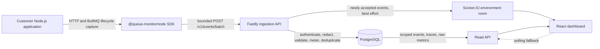
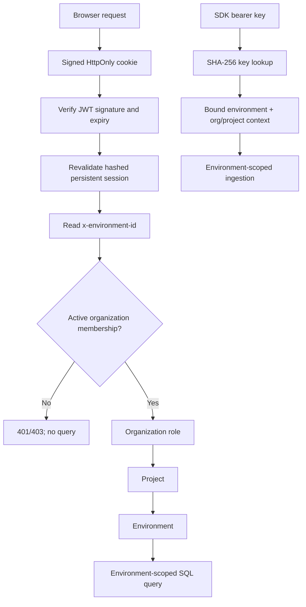
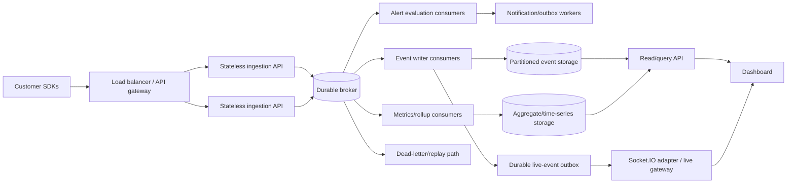
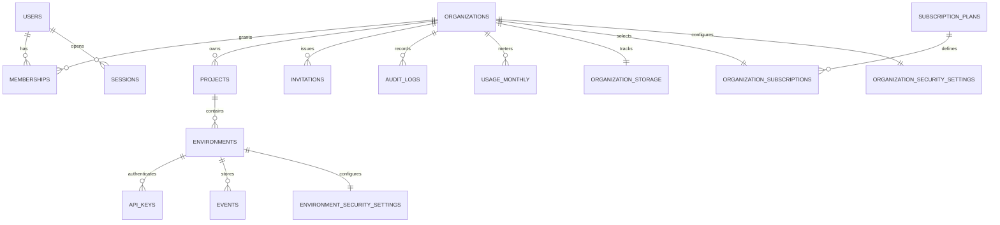

# Queue Monitor: Technical, Product, and Interview Analysis

> Repository review date: 2026-07-17  
> Scope: application code, SDK and shared packages, dashboard, database migrations, scripts, tests, CI workflows, infrastructure, and existing documentation  
> Maturity conclusion: **private-beta foundation**—substantially beyond a UI prototype, but not evidence of a deployed, highly available, compliant enterprise SaaS

## How to read this analysis

This document separates four kinds of claims:

- **Implemented** means the behavior exists in this repository and is supported by source or schema evidence.
- **Locally verified** means a repository test or documented local exercise provides evidence for it.
- **Operational automation prepared** means scripts/workflows exist, but their successful execution in a hosted production account is not proven by the repository.
- **Planned/future work** means the capability is intentionally absent or described as a later evolution.

No production traffic, customer adoption, availability, compliance certification, published npm release, cloud backup success, or enterprise scale is inferred from source code alone. No secret values were inspected or reproduced for this analysis.

## Table of contents

1. [Executive summary](#1-executive-summary)
2. [Problem statement and real-world relevance](#2-problem-statement-and-real-world-relevance)
3. [Current project capability map](#3-current-project-capability-map)
4. [Technical architecture](#4-technical-architecture)
5. [Technology choices](#5-technology-choices)
6. [Data model and API design](#6-data-model-and-api-design)
7. [SDK design](#7-sdk-design)
8. [Security and SaaS readiness](#8-security-and-saas-readiness)
9. [Validation and performance evidence](#9-validation-and-performance-evidence)
10. [Product use cases](#10-product-use-cases)
11. [Product positioning and market relevance](#11-product-positioning-and-market-relevance)
12. [Roadmap](#12-roadmap)
13. [Interview preparation](#13-interview-preparation)
14. [Final assessment](#14-final-assessment)

---

# 1. Executive summary

## What Queue Monitor is

Queue Monitor is a focused observability product for Node.js applications whose work crosses an HTTP boundary and continues asynchronously in BullMQ. Its SDK records the API request, queued job, each worker attempt, retries, completion, and final failure under one trace. A tenant-scoped dashboard then shows the event stream, metrics, event details, and causal timeline in near real time.

The present repository includes more than telemetry visualization. It has a relational SaaS control plane—organizations, projects, environments, users, memberships, roles, sessions, invitations, API keys, usage controls, security settings, audit records, and lifecycle operations—plus a demo application that proves a real Express → BullMQ → ingestion → PostgreSQL → dashboard path. The strongest evidence is in the [API application](../apps/api/src/app.ts), [data store](../apps/api/src/store.ts), [Node SDK](../packages/sdk/src/index.ts), [dashboard](../apps/web/src), [migrations](../apps/api/migrations), and [documented load exercise](load-test.md).

## Core problem

An API can return `202 Accepted` while the work users care about is still waiting in a queue. That work can run on another process, retry minutes later, call another provider, and finally fail after the original request has disappeared from ordinary request logs. Engineers then have fragments—an API log line, a Redis job ID, a worker exception, and perhaps a customer complaint—but no single causal story.

Queue Monitor links those fragments. A `traceId` groups one distributed workflow; each `parentEventId` records the preceding causal event. This is what lets the product explain not just that an order failed, but that its request succeeded, its job queued, attempt one failed, a retry was scheduled, attempt two failed, and the final attempt ended with a provider error.

## Intended users

- Backend engineers maintaining Node.js/TypeScript APIs and BullMQ workers.
- Small platform or SRE teams that need queue-specific visibility without first operating a broad observability stack.
- Engineering leads evaluating reliability of orders, payments, notifications, media jobs, reports, and integrations.
- Support engineers who need to answer “what happened to this request?” from one trace rather than multiple log searches.
- Interviewers or technical reviewers assessing system design, SDK safety, tenancy, security, and an evidence-based scaling path.

## Why asynchronous systems are difficult to debug

Distributed APIs, queues, jobs, and webhooks introduce four breaks in the normal debugging story:

1. **Time:** the request and the eventual worker failure occur at different times.
2. **Process:** API and worker logs live in different processes or services.
3. **Identity:** a request ID, job ID, provider ID, and retry attempt are not automatically the same correlation key.
4. **Causality:** timestamps alone cannot reliably express “this retry was caused by that failed attempt,” especially with clock skew or parallel work.

Queue Monitor addresses identity and causality directly. It does not yet solve every observability problem: it is not a log store, infrastructure monitor, profiler, general OpenTelemetry backend, or alerting platform.

## Strongest one-sentence pitch

> **Trace one API request through every BullMQ transition—including retries and the final provider error—in one live, environment-scoped timeline.**

## 30-second explanation for a non-technical person

“When you place an order, the website often hands work to background systems for payment, email, and delivery. If one of those steps retries or fails, teams normally search several systems to find out why. Queue Monitor gives that order one tracking thread and shows every step—from the first request to the last background attempt—so the team can find the failure much faster.”

## 60-second explanation for an interviewer

“Queue Monitor is a TypeScript observability product focused on Node.js HTTP services and BullMQ. Express or Fastify middleware creates or accepts a W3C-compatible trace ID and emits the HTTP result. The BullMQ adapter embeds a small `_monitor` context in job data, then emits pending, processing, retry, success, or final-failure events with parent IDs. The SDK buffers those events and sends bounded batches without awaiting the network in the customer request path. A Fastify ingestion API authenticates an environment-bound hashed API key, redacts and validates each event, applies quota and rate policies, deduplicates on environment plus event ID, writes PostgreSQL, and publishes new rows to an authenticated Socket.IO room. The React dashboard reads environment-scoped metrics and trace timelines and refreshes through Socket.IO plus polling. It is designed and tested as a private-beta foundation; broker-backed ingestion, aggregate storage, durable live publication, advanced identity, and production operations remain explicit next stages.”

## Two-minute product demo narrative

1. Sign in to the populated, viewer-only demo workspace and select its demo environment. Explain that the session is held in an HttpOnly cookie and every query is scoped through organization membership and the selected environment.
2. Open the overview. Point out request volume, failure rate, latency, and queue-state counts generated over the previous 30 days through the real ingestion endpoint—not by inserting telemetry rows directly.
3. Start a live failure scenario with the prepared `npm run demo:live-failure` command. It calls the real demo order endpoint, whose Express middleware and BullMQ wrappers emit telemetry through the public SDK path.
4. Show the new event arrive without a page refresh. Open its trace.
5. Walk the eight-event chain: HTTP success → queued → processing attempt 1 → retry → processing attempt 2 → retry → processing attempt 3 → final failure.
6. Open the final event and point to the simulated provider error. Explain that `traceId` groups all eight events while `parentEventId` preserves exact causal order.
7. Close honestly: “This demo proves the local end-to-end product path and tenant-safe read model. It does not claim production availability or internet-scale ingestion; the next architecture stage adds a durable broker, independent consumers, aggregates, and horizontally coordinated live delivery.”

---

# 2. Problem statement and real-world relevance

## The “payment succeeded but order was not confirmed” failure

Consider an order workflow:

```text
POST /orders
  → authorize payment
  → enqueue order-finalization
  → reserve inventory
  → send confirmation
```

The payment provider may approve the charge while `order-finalization` fails to update inventory. The API log says `202`; the payment webhook log says `200`; the queue records several attempts; the customer sees no confirmation. A timestamp search can miss the relationship, especially when multiple orders run concurrently. A correlated trace can instead show:

```text
http_request:success
  └─ queue_job:pending
      └─ queue_job:processing (attempt 1)
          └─ queue_retry:retrying (provider timeout)
              └─ queue_job:processing (attempt 2)
                  └─ queue_failed:failure (inventory conflict)
```

That sequence answers three different questions: Did the API accept the work? Did the worker run? Why did the workflow finally fail?

## Retries are behavior, not noise

A retry can be healthy resilience—a transient timeout recovered on attempt two—or an early warning that a provider is degrading. A final failure is a different operational outcome. Queue Monitor models pending, processing, retry, completion, and final failure as explicit typed events. This makes a retry chain inspectable rather than hiding it in repeated unstructured error strings.

The current adapter is nevertheless narrower than complete queue observability. It instruments cooperative BullMQ wrappers and does **not** yet collect queue depth, waiting time, delayed/paused/stalled states, scheduler health, or every native BullMQ transition. Those are roadmap items, not present capabilities.

## Why logs alone are insufficient

Logs remain valuable for detailed diagnostics, but they usually have weaknesses for this problem:

- correlation fields may be missing or named differently across services;
- retries appear as separate lines without an explicit parent relationship;
- high-cardinality searches can be expensive;
- ordering by wall-clock time is vulnerable to clock skew;
- a support engineer must know which services and indexes to search;
- a successful request log does not represent downstream business completion.

Queue Monitor does not replace logs. It stores a compact, validated workflow event model and uses logs as a complementary source for deeper detail.

## Why trace correlation matters

A distributed trace represents the path and relationships of work across system boundaries. OpenTelemetry defines traces as the path of a request through an application and uses context propagation to correlate work across services; it is a vendor-neutral framework, not itself an observability backend ([OpenTelemetry overview](https://opentelemetry.io/docs/what-is-opentelemetry/), [OpenTelemetry traces](https://opentelemetry.io/docs/concepts/signals/traces/)). Queue Monitor adopts the W3C `traceparent` trace ID at its HTTP boundary and adds an event-parent chain suited to its queue timeline. It does not implement full OpenTelemetry spans, baggage, `tracestate`, or OTLP export.

This focus matters because queue work crosses an asynchronous handoff. The [W3C Trace Context recommendation](https://www.w3.org/TR/trace-context/) standardizes propagation headers, while Queue Monitor’s `_monitor` object carries the relevant context inside BullMQ job data where an HTTP header no longer exists.

## Industry relevance by workflow

| Domain             | Typical asynchronous work                       | Failure that correlation exposes                               |
| ------------------ | ----------------------------------------------- | -------------------------------------------------------------- |
| E-commerce         | inventory reservation, fulfillment, email       | accepted order repeatedly fails warehouse provider             |
| Payments           | webhook handling, ledger update, reconciliation | payment succeeds but downstream ledger job exhausts retries    |
| Delivery/logistics | driver matching, route update, notifications    | assignment job retries after provider throttling               |
| Media              | upload, transcode, thumbnail, moderation        | API accepts upload but transcode worker fails on attempt three |
| Notifications      | template render, provider send, callback        | provider timeout recovers on retry or becomes final failure    |
| SaaS platforms     | reports, imports, exports, billing sync         | long-running work disappears after a successful API response   |

The category is current rather than hypothetical. The CNCF’s 2025 annual report describes OpenTelemetry as its second-largest project and reports contributor growth from 1,301 to 1,756, evidence that standardized telemetry and distributed tracing remain active infrastructure concerns ([CNCF Annual Report 2025, p. 20](https://www.cncf.io/wp-content/uploads/2026/03/cncf_ar25_033126a.pdf)). BullMQ itself documents retries, horizontally scalable workers, and worst-case at-least-once processing, and now documents OpenTelemetry-based telemetry hooks ([BullMQ introduction](https://docs.bullmq.io/), [BullMQ telemetry](https://docs.bullmq.io/guide/telemetry)).

## Logs, metrics, traces, events, alerting, and queue monitoring

| Signal/capability | Primary question                            | Typical shape                      | Queue Monitor today                                                           |
| ----------------- | ------------------------------------------- | ---------------------------------- | ----------------------------------------------------------------------------- |
| Logs              | “What detail did this component print?”     | text or structured records         | Not a general log store; error fields/metadata are intentionally bounded      |
| Metrics           | “How much/how often/how slow?”              | numeric time series and aggregates | Request counts, failure rate, HTTP latency, queue status counts, trends       |
| Traces            | “What path did this operation take?”        | correlated spans/events            | Focused HTTP-to-BullMQ event timeline, not a full span backend                |
| Events            | “What discrete transition occurred?”        | typed record with time/context     | Core storage model: HTTP, queue, retry, failure, webhook events               |
| Alerting          | “When should someone be notified?”          | rules, state, routing, delivery    | **Not implemented**; public status records are not telemetry alerting         |
| Queue monitoring  | “What is waiting/running/retrying/failing?” | job lifecycle and queue health     | Lifecycle correlation implemented; depth/latency/stalled/global health absent |

## Honest comparison with established tools

| Product/category            | Real overlap                                    | Queue Monitor’s focused difference                                                           | What Queue Monitor does not replace                                                                                                                                                                                                                                                                                         |
| --------------------------- | ----------------------------------------------- | -------------------------------------------------------------------------------------------- | --------------------------------------------------------------------------------------------------------------------------------------------------------------------------------------------------------------------------------------------------------------------------------------------------------------------------- |
| Datadog APM                 | request/error/latency views, traces, monitors   | opinionated Node/BullMQ causal timeline and small-stack onboarding                           | Datadog’s broad APM, infrastructure, logs, security, data streams, integrations, and operational maturity ([Datadog APM](https://www.datadoghq.com/product/apm/), [trace metrics](https://docs.datadoghq.com/tracing/metrics/))                                                                                             |
| New Relic                   | APM, traces, errors, queue/stream visibility    | purpose-built queue retry narrative                                                          | broad full-stack telemetry, alerting, logs, infrastructure, and managed platform capabilities ([New Relic platform](https://newrelic.com/platform))                                                                                                                                                                         |
| Grafana ecosystem           | dashboards, metrics, logs, traces, correlations | pre-shaped workflow events and BullMQ setup rather than assembling multiple backends         | Grafana Cloud’s logs/metrics/traces/profiles, TraceQL, RED dashboards, alerting, and ecosystem breadth ([Grafana Cloud overview](https://grafana.com/docs/grafana-cloud/introduction/), [application observability](https://grafana.com/docs/grafana-cloud/monitor-applications/application-observability/manual/service/)) |
| Sentry                      | developer-centric errors and tracing            | queue lifecycle and retry causality are the primary object                                   | mature error grouping, stack-centric debugging, performance product, release context, and integrations ([Sentry error monitoring](https://sentry.io/product/error-monitoring/), [Sentry tracing](https://sentry.io/product/tracing/))                                                                                       |
| OpenTelemetry               | W3C trace context and instrumentation concepts  | a usable product and opinionated event model for one workflow                                | OTel is a vendor-neutral instrumentation framework; Queue Monitor is not a collector/OTLP-compatible general backend ([OpenTelemetry](https://opentelemetry.io/docs/what-is-opentelemetry/))                                                                                                                                |
| BullMQ dashboards/telemetry | jobs, retries, state and metrics                | connects the originating HTTP request to the worker’s causal chain inside a tenant SaaS view | complete native queue administration, every queue state, or broad OTel collection ([BullMQ telemetry metrics](https://docs.bullmq.io/guide/telemetry/metrics))                                                                                                                                                              |

A focused product can still be useful because it shortens time-to-answer for a narrow, costly question. It can offer a smaller integration surface, an opinionated timeline, and predictable onboarding for Node/BullMQ teams. The strategy should be “best workflow debugging for this stack,” not “cheaper Datadog with every feature.”

---

# 3. Current project capability map

| Feature                                                  | Current status                                           | How it works                                                                                                                                                                              | User value                                                                                | Important files/modules                                                                                                                                                        |
| -------------------------------------------------------- | -------------------------------------------------------- | ----------------------------------------------------------------------------------------------------------------------------------------------------------------------------------------- | ----------------------------------------------------------------------------------------- | ------------------------------------------------------------------------------------------------------------------------------------------------------------------------------ |
| Organization → project → environment multi-tenancy       | **Implemented**                                          | Organization memberships authorize projects; projects own environments; API keys and events bind to environments                                                                          | Separates customers, applications, and deployment stages                                  | [multi-tenant migration](../apps/api/migrations/002_multi_tenant_environments.sql), [tenant lookups](../apps/api/src/store.ts#L830)                                            |
| Authentication and persistent HttpOnly sessions          | **Implemented**                                          | HS256 JWT in a host-only HttpOnly `SameSite=Lax` cookie; SHA-256 token hash and revocable session row revalidated on requests                                                             | Browser token is unavailable to JavaScript and can be revoked server-side                 | [auth](../apps/api/src/auth.ts), [session middleware](../apps/api/src/app.ts#L190), [session schema](../apps/api/migrations/004_security_saas_operations.sql#L1)               |
| RBAC and invitations                                     | **Implemented**                                          | Owner/admin/developer/viewer membership; hashed, expiring invitation tokens; last-owner and admin protections                                                                             | Supports a small SaaS team safely                                                         | [RBAC store methods](../apps/api/src/store.ts#L895), [invitation routes](../apps/api/src/app.ts#L680), [external-beta migration](../apps/api/migrations/003_external_beta.sql) |
| API-key lifecycle, expiration, rotation, revocation      | **Implemented with caveat**                              | High-entropy environment key shown once, SHA-256 hash at rest, prefix metadata, optional expiry/revocation. Rotation is create-new → deploy → revoke-old, not one atomic endpoint         | Separates SDK ingestion credentials by environment and limits exposure                    | [key routes](../apps/api/src/app.ts#L810), [key storage](../apps/api/src/store.ts#L670), [security guide](security.md#api-key-lifecycle)                                       |
| Event ingestion and batch validation                     | **Implemented**                                          | Bearer key establishes tenant; up to 100 events are redacted, type-validated, size/depth checked, partially accepted, and stored                                                          | Bad telemetry cannot poison the whole batch; producers receive per-item rejection details | [ingestion route](../apps/api/src/app.ts#L920), [shared validation](../packages/shared/src/validation.ts)                                                                      |
| Sensitive-data redaction                                 | **Implemented, bounded**                                 | SDK redacts configured keys; server additionally detects credential fields/strings, SSNs, Luhn-valid cards, and optionally email/phone/custom fields before storage                       | Reduces accidental secret/PII retention                                                   | [SDK redaction](../packages/sdk/src/client.ts#L82), [server redaction](../packages/shared/src/validation.ts#L52), [security settings](../apps/api/src/store.ts#L1290)          |
| SDK buffering, retry, sampling, backpressure, safe drops | **Implemented with known debt**                          | Memory buffer, default batch 25/500 ms, max 1,000, drop-oldest/newest, bounded jittered retries for retryable failures, per-event random sampling, diagnostics                            | Monitoring failure does not block or crash the host workload                              | [SDK client](../packages/sdk/src/client.ts), [SDK README](../packages/sdk/README.md)                                                                                           |
| Express instrumentation                                  | **Implemented**                                          | Middleware captures route template, method, status, latency, request ID, trace context and errors; error middleware attaches failure detail                                               | Low-effort HTTP visibility                                                                | [Express adapter](../packages/sdk/src/express.ts)                                                                                                                              |
| Fastify instrumentation                                  | **Implemented**                                          | Plugin hooks `onRequest`, `onError`, and `onResponse` with equivalent context/result capture                                                                                              | Supports the ingestion stack’s framework and customer Fastify services                    | [Fastify adapter](../packages/sdk/src/fastify.ts)                                                                                                                              |
| BullMQ instrumentation                                   | **Implemented for core lifecycle**                       | Instrumented enqueue adds `_monitor`; worker wrapper emits pending, processing, retry, success/final failure and advances parent context                                                  | One trace exposes every demo retry attempt                                                | [BullMQ adapter](../packages/sdk/src/bullmq.ts), [demo processor](../apps/demo-service/src/processor.ts)                                                                       |
| W3C `traceparent` support                                | **Implemented at boundary**                              | Accepts valid W3C trace ID/upstream span and returns a child `traceparent`; also supports `x-trace-id`                                                                                    | Can join an existing distributed trace identity                                           | [trace context](../packages/sdk/src/context.ts)                                                                                                                                |
| `traceId` and `parentEventId` causal chains              | **Implemented**                                          | Trace ID groups the workflow; every event ID becomes the next causal parent through job data                                                                                              | Shows actual retry order rather than approximate timestamp grouping                       | [BullMQ parent flow](../packages/sdk/src/bullmq.ts#L61), [trace ordering](../apps/api/src/store.ts#L466)                                                                       |
| PostgreSQL JSONB event storage and indexes               | **Implemented**                                          | Common filter fields are relational; variable metadata is JSONB; tenant/time/trace/type/queue and GIN indexes support beta queries                                                        | Flexible event evolution without surrendering core query structure                        | [initial event schema](../apps/api/migrations/001_initial.sql#L38), [final event indexes](../apps/api/migrations/002_multi_tenant_environments.sql#L93)                        |
| Event stream, filters, details, trace timeline           | **Implemented**                                          | Dashboard provides paginated event filters, detail drawer, full trace view, overview metrics and failure context                                                                          | Engineers can move from symptom to causal chain                                           | [events page](../apps/web/src/pages/EventsPage.tsx), [trace page](../apps/web/src/pages/TracePage.tsx), [overview](../apps/web/src/pages/OverviewPage.tsx)                     |
| Real-time Socket.IO updates                              | **Implemented, best effort/single-node**                 | Persisted new events emit to authenticated environment rooms; UI refetches and also polls as fallback                                                                                     | New failures appear without a manual refresh                                              | [Socket server](../apps/api/src/server.ts#L44), [live provider](../apps/web/src/live.tsx)                                                                                      |
| Usage, quotas, and rate limits                           | **Implemented for beta**                                 | Monthly counters/retained storage plus organization/environment/key PostgreSQL token buckets and plan limits                                                                              | Controls abuse and makes future billing measurable                                        | [SaaS operations migration](../apps/api/migrations/004_security_saas_operations.sql#L53), [authorization/metering](../apps/api/src/store.ts#L1409)                             |
| Retention, export, and deletion                          | **Implemented with scale limits**                        | Organization retention choices and scheduled deletion; owner/admin JSON/CSV export capped at 50,000 events; typed destructive confirmations and cascades                                  | Basic data lifecycle and customer control                                                 | [lifecycle routes](../apps/api/src/app.ts#L543), [retention/export store](../apps/api/src/store.ts#L1581), [operations workflow](../.github/workflows/operations.yml)          |
| Audit logs                                               | **Implemented within primary DB**                        | App writes actor/action/target/result context; DB trigger rejects update/delete                                                                                                           | Administrative accountability for beta operations                                         | [audit schema/trigger](../apps/api/migrations/004_security_saas_operations.sql#L27), [audit API](../apps/api/src/app.ts#L489)                                                  |
| Demo workspace and generated telemetry                   | **Implemented**                                          | Idempotent control-plane seed creates viewer/internal key; deterministic 30-day fixture posts 1,230 events through actual ingestion; live failure uses real Express/SDK/BullMQ path       | A visitor can safely inspect data and watch a real eight-step failure                     | [account seed](../scripts/seed-demo-account.ts), [generator](../scripts/generate-demo-data.ts), [live failure](../scripts/live-demo-failure.ts)                                |
| Backup/restore scripts and operations docs               | **Operational automation prepared**                      | `pg_dump`, archive validation, client-side encryption/checksum, guarded restore; scheduled backup/retention and monthly drill workflow definitions                                        | Establishes a responsible beta runbook                                                    | [backup](../scripts/backup.sh), [restore](../scripts/restore-backup.sh), [operations guide](operations.md), [restore workflow](../.github/workflows/restore-drill.yml)         |
| Tests, CI, scans, and load evidence                      | **Implemented/local evidence; remote outcomes unproven** | 69 declared tests across packages/apps, service-backed integrations in CI, lint/format/typecheck/migrations/tests/build/secret scan/audit/dependency review, custom 1,000-scenario runner | Makes correctness and limitations reviewable                                              | [CI](../.github/workflows/ci.yml), [load report](load-test.md), [load runner](../apps/demo-service/scripts/load-test.ts)                                                       |
| Alert rules and notifications                            | **Not implemented**                                      | Public incident/maintenance read models exist, but telemetry does not evaluate alert rules or route notifications                                                                         | No automatic page/email/Slack promise yet                                                 | [status routes](../apps/api/src/app.ts#L316), [operations limitations](operations.md)                                                                                          |
| Billing/payment collection                               | **Not implemented**                                      | Plan and usage records form a metering boundary; no payment provider, invoices, checkout, or billing webhook                                                                              | Avoids pretending seeded plans are commercial billing                                     | [billing design](billing.md)                                                                                                                                                   |
| Full OpenTelemetry/OTLP                                  | **Not implemented**                                      | W3C trace-ID interoperability only                                                                                                                                                        | Avoids an inaccurate standards claim                                                      | [external-beta limits](external-beta.md#beta-limitations)                                                                                                                      |

## Most important present limitations

- Telemetry writes, raw analytics, usage, sessions, rate buckets, retention, and exports share one PostgreSQL deployment.
- SDK buffering is memory-only and sampling is per event, so a sampled trace can be incomplete.
- Socket.IO publication occurs after commit without a transactional outbox; polling repairs the view but live delivery is not durable.
- Authorization is systematically environment-scoped in application SQL, but PostgreSQL row-level security is absent.
- Metrics are computed from raw events; list queries use `COUNT(*)` and offset pagination.
- BullMQ support is wrapper-based and omits depth, wait latency, delayed, stalled, and paused states.
- Historical fixtures use the real ingestion API but direct `fetch`, not `QueueMonitorClient`; the live demo is the end-to-end SDK proof.
- Workflow files are evidence of automation design, not evidence of successful hosted CI, backup, restore, or release runs.

---

# 4. Technical architecture

## 4.1 Current telemetry flow



The SDK deliberately does not wait for telemetry network delivery in the request callback. The API key resolves to an environment before payload processing, and the server performs redaction before validation/persistence. New, non-duplicate rows are emitted to one environment room. The dashboard treats the socket as an invalidation signal and refetches authoritative data; timed polling provides recovery from missed live messages. See the [ingestion route](../apps/api/src/app.ts#L920), [event insert](../apps/api/src/store.ts#L1856), [Socket.IO server](../apps/api/src/server.ts#L44), and [live provider](../apps/web/src/live.tsx).

## 4.2 Trace propagation flow

```mermaid
sequenceDiagram
    participant C as Caller
    participant H as Express/Fastify middleware
    participant Q as InstrumentedQueue
    participant R as Redis/BullMQ
    participant W as Instrumented worker
    participant M as Queue Monitor

    C->>H: HTTP request + optional traceparent/x-trace-id
    H->>H: accept valid traceId or generate UUID
    H-->>M: http_request event (eventId H1)
    H->>Q: context {traceId, parentEventId: H1}
    Q->>R: job data + _monitor {traceId, parentEventId: Q1}
    Q-->>M: queue_job:pending (eventId Q1, parent H1)
    R->>W: attempt 1
    W-->>M: queue_job:processing (eventId W1, parent Q1)
    W-->>M: queue_retry:retrying (eventId R1, parent W1)
    W->>R: persist next _monitor parent R1
    R->>W: next attempt
    W-->>M: processing then success or final failure
    M->>M: group by traceId; order through parentEventId
```

`traceId` answers “which workflow?”; `parentEventId` answers “what directly caused this transition?” The worker rewrites the monitoring parent after a retry so a later attempt does not merely point back to the initial enqueue. This yields the exact demo chain asserted by the [trace validator](../apps/demo-service/scripts/validate-trace.ts#L76). The current view works best for a linear workflow; general fan-out needs a tree/DAG presentation.

## 4.3 Multi-tenant authorization flow



Membership is organization-wide, so a role currently applies to every project/environment in that organization. Browser routes resolve the environment through membership; they do not trust a client-supplied organization ID as authority. SDK writes use the server-resolved environment of the key. The design is consistent in current paths, but it relies on application-layer SQL rather than database row-level security.

## 4.4 Future scalable architecture



This is a trigger-driven evolution, not a claim that Kafka or ClickHouse should be introduced immediately. A durable broker becomes justified when burst absorption, replay, ingestion latency isolation, or independent consumers are real requirements. Partitioning and rollups come when retention/aggregate scans measurably affect the primary database. A separate analytical store comes only when tested workload and cost show PostgreSQL is no longer the right read/write compromise.

## 4.5 Component responsibilities and scaling considerations

| Component                | Responsibility and key data                                                                              | Why selected now                                                             | Failure behavior                                                                                | Scaling considerations                                                                               |
| ------------------------ | -------------------------------------------------------------------------------------------------------- | ---------------------------------------------------------------------------- | ----------------------------------------------------------------------------------------------- | ---------------------------------------------------------------------------------------------------- |
| Node SDK                 | Create event IDs/context; capture HTTP/BullMQ events; redact configured keys; buffer and deliver batches | Same language/runtime as target users; direct framework adapters             | Bounded retries then safe drop; memory contents can be lost on crash; host app continues        | Trace-consistent sampling, optional disk spool, compression, more adapters, measured overhead        |
| Express/Fastify adapters | Capture route template, method, status, duration, error and trace headers                                | Minimal integration for common Node frameworks                               | Errors are observed but not swallowed; instrumentation work still consumes small CPU            | Avoid high-cardinality paths; framework/version compatibility tests                                  |
| BullMQ/Redis             | Carry business jobs and `_monitor` context; schedule attempts                                            | BullMQ is the actual target queue and supports retries/workers on Redis      | Redis outage disrupts demo job flow; queue-add failure currently emits no pending event         | Collect depth/wait/stalled states; separate connection policy; worker autoscaling                    |
| Fastify API              | Auth, control plane, ingestion, validation, reads and lifecycle                                          | Fastify offers typed, performant Node routing with a small footprint         | Returns explicit rejection/limits; write and live publish can diverge without outbox            | Split control/read/ingest roles; stateless replicas; broker handoff; auth endpoint abuse controls    |
| PostgreSQL               | Relational tenancy/auth/usage plus event rows and raw aggregates                                         | One transactional system keeps MVP operations and consistency understandable | Primary DB outage affects most product functions; direct ingest has no durable alternate buffer | Index tuning, cursor pagination, partitioning, replicas, rollups, then analytical store if triggered |
| JSONB metadata           | Hold event-type-specific fields while fixed columns remain indexable                                     | Schema flexibility without a separate document store                         | Oversized/deep payloads rejected; GIN adds write/storage cost                                   | Track cardinality/storage; index only demonstrated queries; schema-promote common fields             |
| Socket.IO                | Deliver best-effort environment-scoped invalidations                                                     | Simple bidirectional authenticated browser channel                           | Missed message is recovered by polling; connected socket is not continuously reauthorized       | Redis/compatible adapter, sticky-session strategy, outbox/replay, disconnect on authorization change |
| React/Vite dashboard     | Login, tenant/environment context, metrics, filters, details, trace timeline/settings                    | Fast iteration and static production bundle                                  | Read failures shown to user; polling keeps data eventually current                              | Virtualized streams, cursor paging, cached queries, large-trace tree UI                              |
| Demo service             | Deterministic success/retry/failure order path                                                           | Makes the product’s causal promise visibly testable                          | Intentionally simulated provider failures; `/orders` is unauthenticated demo surface            | Presentation tool, not a production service benchmark                                                |
| Control-plane scripts    | Seed/reset demo; migrations; retention; backup/restore                                                   | Repeatability and safer operations                                           | Guards reduce accidental destructive scope; still depend on operator/cloud correctness          | Managed migration jobs, verified drills, infrastructure as code, least-privilege identities          |

---

# 5. Technology choices

## Technology decision table

| Technology                       | Where used                                                         | Why chosen                                                                                    | Benefits                                                                                | Tradeoffs                                                                                                                  | Interview explanation                                                                                            |
| -------------------------------- | ------------------------------------------------------------------ | --------------------------------------------------------------------------------------------- | --------------------------------------------------------------------------------------- | -------------------------------------------------------------------------------------------------------------------------- | ---------------------------------------------------------------------------------------------------------------- |
| TypeScript                       | All apps, SDK, shared types, scripts                               | One language across producer, server, UI, and tooling                                         | Shared contracts, strong refactoring, good Node ecosystem                               | Runtime inputs still need validation; types do not enforce network/schema truth                                            | “TypeScript reduces contract drift, while shared runtime validation remains the trust boundary.”                 |
| Node.js                          | API, demo service, SDK tooling                                     | Native fit for target Node/BullMQ users and asynchronous I/O                                  | Same execution model as customer apps; fast product iteration                           | CPU-heavy analytics and large synchronous exports need care; single event loop per process                                 | “The product observes Node workloads from a Node-native SDK, then scales with processes and external state.”     |
| Fastify                          | `apps/api`                                                         | Compact high-throughput HTTP server with hooks and structured logging                         | Good ingestion/control-plane fit; straightforward request lifecycle                     | Smaller team familiarity than Express; current app still combines several responsibilities                                 | “Fastify gives a lean ingestion boundary, but durable architecture matters more than framework benchmarks.”      |
| Express                          | Demo service and customer middleware                               | Most familiar integration target for Node APIs                                                | Low-friction adoption and clear middleware model                                        | Error middleware/order can be misconfigured; route templates only exist after routing                                      | “Express proves the common customer path; the adapter captures templates rather than raw high-cardinality URLs.” |
| BullMQ                           | SDK adapter and demo `process-order` queue                         | Redis-backed queue with retries, attempts, workers, and strong Node adoption                  | Real asynchronous handoff and deterministic retry demo                                  | Redis is an operational dependency; worst-case processing is at least once; wrapper does not cover every native state      | “BullMQ is the initial wedge because it exposes the exact retry problem the product makes visible.”              |
| Redis/Valkey-compatible protocol | BullMQ backend and future live coordination candidate              | Required by BullMQ; low-latency queue coordination                                            | Mature job scheduling and horizontal worker model                                       | Current local Redis has no auth and is not an event-ingestion broker; job persistence must be operated carefully           | “Redis currently runs customer demo jobs, not the telemetry durability layer.”                                   |
| PostgreSQL                       | Tenancy, sessions, keys, events, usage, rate buckets, audit, reads | Small operational footprint with relational integrity, transactions, SQL analytics, and JSONB | Strong MVP consistency; idempotency constraint; one backup/migration model              | Too many workloads converge on one DB; raw telemetry scans, retention deletes, and rate-bucket contention will limit scale | “Postgres is the right private-beta default, not a forever claim for unlimited telemetry.”                       |
| JSONB                            | Variable event metadata and audit metadata                         | Event types evolve faster than the relational control plane                                   | Flexible shape plus JSON operators and GIN indexing                                     | Weaker schema discoverability; GIN write/storage cost; uncontrolled cardinality can be expensive                           | “Promote frequently queried fields to columns; keep genuinely variable context in bounded JSONB.”                |
| React 19                         | Dashboard                                                          | Component model for authenticated product UI                                                  | Reusable pages/context and fast interactive UX                                          | Client state, permissions, accessibility, and large lists need deliberate testing                                          | “React is product delivery plumbing; authorization remains enforced by the API.”                                 |
| Vite                             | Dashboard dev/build                                                | Fast local feedback and simple static bundle                                                  | Minimal configuration and efficient development                                         | Does not supply production hosting, SSR, or server security by itself                                                      | “Vite keeps the dashboard build simple; Nginx provides the local production-like static/proxy layer.”            |
| Socket.IO                        | API and dashboard                                                  | Environment rooms, reconnect behavior, browser-friendly live events                           | Quick real-time feedback with polling fallback                                          | Single-node today; no durable replay/outbox; multi-node needs adapter and connection planning                              | “Sockets improve freshness, while REST remains authoritative.”                                                   |
| Zod                              | Runtime configuration and selected app inputs                      | Declarative runtime checking at untrusted boundaries                                          | Clear startup errors and typed parsed values                                            | Telemetry validation is a separate shared manual validator; two validation styles must remain consistent                   | “Static types stop at the network, so configuration and inputs are parsed at runtime.”                           |
| JWT + persistent cookie sessions | Browser authentication                                             | Signed compact claims plus server-side revocation                                             | HttpOnly cookie avoids JavaScript token storage; session row supports logout/revocation | HS256 key rotation/issuer/audience absent; request-time DB validation adds writes/latency                                  | “It intentionally is not a fully stateless JWT design: revocation is worth the database lookup for beta.”        |
| npm workspaces monorepo          | Root, apps, packages                                               | Atomic SDK/shared/API/demo/dashboard development                                              | One install, shared contracts, coordinated CI and versions                              | Coupled releases/build graph; repository also has stale pnpm artifacts, causing ambiguity                                  | “A monorepo makes cross-boundary telemetry changes testable in one commit.”                                      |
| Docker Compose                   | `infra/docker-compose.yml`                                         | Reproduce PostgreSQL, Redis, API, demo, dashboard locally                                     | One command and dependency health checks                                                | Local topology only; exposed data ports, root images, no `.dockerignore`, TLS/autoscaling/secrets/IaC absent               | “Compose is a development acceptance environment, not the deployment architecture.”                              |
| GitHub Actions CI                | `.github/workflows`                                                | Repeatable quality, dependency, release, backup, and restore definitions                      | Services for integration tests; migration checks; provenance-ready SDK release          | Configuration is not proof of successful runs; scans are not a complete AppSec program                                     | “The repo encodes gates, but I only claim results I can point to.”                                               |
| Custom TypeScript load runner    | Demo service scripts                                               | Measures the exact end-to-end business trace and checks database causality                    | Understands expected event count, parents, terminal states, and SQL latency             | One local topology; not a distributed load tool; loopback timings                                                          | “Correctness under 1,000 mixed scenarios mattered more than a headline RPS number.”                              |
| k6                               | Nowhere                                                            | **Not present**                                                                               | None in current repository                                                              | No standardized k6 scenarios or distributed load execution                                                                 | “I would not claim k6; the current runner is purpose-built TypeScript.”                                          |

## Why PostgreSQL plus JSONB fits this MVP

The data has two different shapes:

- Identity, membership, API keys, sessions, usage, and lifecycle operations require relational constraints and transactions.
- Telemetry has stable query dimensions—environment, trace, type, status, source, timestamps, HTTP/queue/error fields—plus evolving event-specific details.

PostgreSQL handles both without adding another datastore. The project keeps common filters in typed columns and variable context in bounded JSONB, with tenant/time/trace/type/queue indexes and a metadata GIN index. PostgreSQL documents that `jsonb` is faster to process than reparsing `json` and supports indexing, while also noting that targeted expression indexes can be smaller and faster than a broad index when query patterns are known ([PostgreSQL JSON types](https://www.postgresql.org/docs/16/datatype-json.html)).

This does not make PostgreSQL automatically ideal at very high telemetry volume. Sustained high-cardinality writes amplify indexes; raw percentile/trend scans compete with ingestion; row deletion makes retention expensive; deep offset pagination and exports consume resources; and one primary becomes a shared failure/contention domain. PostgreSQL partitioning can make retention and hot-range queries more manageable, but its own documentation cautions that partitioning pays off mainly when tables become very large and good partition pruning is possible ([PostgreSQL partitioning](https://www.postgresql.org/docs/current/ddl-partitioning.html)). Beyond that trigger, rollups and a columnar analytical store may be economically better.

## Why BullMQ

BullMQ is the actual workflow engine this product targets. It supplies named queues, jobs, attempts, retries/backoff, workers, and horizontal worker concurrency on Redis. Its documentation also acknowledges worst-case at-least-once processing, which is why Queue Monitor uses stable event IDs and idempotent inserts rather than assuming one delivery ([BullMQ documentation](https://docs.bullmq.io/)). The strategic choice is a narrow first adapter with a complete story, not superficial support for several queue systems.

## Why buffered, non-blocking batches

A monitoring SDK must not become a new dependency in the customer’s critical path. `emit()` performs local bounded work, adds an event to memory, and starts flush work without requiring the host request to await ingestion. Batching amortizes HTTP/TLS overhead and lets the API validate up to 100 events at once. Bounds matter: if the monitoring service is unavailable, an unbounded buffer would turn an observability outage into a customer memory outage.

“Non-blocking” is not “zero overhead.” Redaction, allocation, serialization, timers, and `fetch` still use CPU/memory, and the repository has no dedicated SDK-overhead benchmark. The defensible claim is **non-awaited, bounded, fail-open delivery**.

## Why idempotency, trace IDs, parent IDs, and hashed API keys

- **Idempotency:** a timeout can occur after the server accepted a batch. Retrying the same event IDs must not create duplicate timeline entries. The unique `(environment_id, event_id)` constraint and `ON CONFLICT DO NOTHING` implement this storage boundary.
- **Trace ID:** groups all events belonging to one business workflow, even across processes and retries.
- **Parent event ID:** preserves direct causality and exact attempt order. One trace ID alone creates an unordered bag of events.
- **Hashed API key:** a random bearer key has high entropy, so SHA-256 permits exact lookup without retaining the reusable secret. This differs from passwords, which need a deliberately slow password hash because users choose low-entropy values.

## Why live connections and environment isolation

WebSockets/Socket.IO make a failure visible during an incident without refreshing. Polling remains valuable because the socket notification is best effort and the database is authoritative. At multiple API nodes, Socket.IO requires shared coordination. Its Redis adapter forwards packets through Redis Pub/Sub but does not persist them, and multi-node deployments still require appropriate connection/session handling ([Socket.IO Redis adapter](https://socket.io/docs/v4/redis-adapter/), [using multiple nodes](https://socket.io/docs/v4/using-multiple-nodes/)).

WebSockets and Server-Sent Events (SSE) are both useful because the server can push freshness signals instead of waiting for the next poll. Socket.IO is implemented here because environment rooms, reconnect behavior, and future bidirectional control are convenient. SSE would be a simpler unidirectional alternative for event notifications, but it is **not implemented** in this repository and would still need authorization, replay/cursors, backpressure, and horizontal fan-out design.

Environment isolation matters because production and staging telemetry can contain the same service/route names but have very different sensitivity, volume, and retention policies. Binding both ingestion and reads to an environment reduces accidental cross-stage and cross-customer exposure.

---

# 6. Data model and API design

## 6.1 Domain model



The final schema is built across [migration 001](../apps/api/migrations/001_initial.sql), [002](../apps/api/migrations/002_multi_tenant_environments.sql), [003](../apps/api/migrations/003_external_beta.sql), [004](../apps/api/migrations/004_security_saas_operations.sql), and [005](../apps/api/migrations/005_demo_workspace.sql). It contains users, organizations, memberships, projects, environments, API keys, events, invitations, onboarding, sessions, password-reset tokens, audit logs, plan/subscription/usage/storage records, rate-limit buckets, security settings, public status incidents, and maintenance windows.

Two distinctions are important:

- `status_incidents` and `maintenance_windows` support a manually managed public status view. They are **not** telemetry-derived alerts or an incident-management engine.
- Subscription plans and usage enforcement exist, but payment collection and billing-provider workflows do **not**.

## 6.2 Tenant and environment isolation

Organization membership is the authorization root. A member’s role applies across all projects/environments in the organization. Browser reads supply `x-environment-id`; the server joins that environment through project and organization membership before running environment-scoped SQL. SDK ingestion does not accept a tenant selector as authority: the API key lookup supplies the environment.

The implementation benefits are simple SQL and centralized checks. The limitation is defense in depth: no PostgreSQL row-level security policy protects against a future query that forgets the environment predicate. High-value next steps are a repository-level tenant-query convention/test harness and, when operationally justified, RLS or separate database roles for read/ingest/control-plane paths.

## 6.3 Event schema

The `events` table keeps the following query dimensions relational:

- tenant/environment and event identity;
- `trace_id` and optional `parent_event_id`;
- type, status, source;
- occurrence and receipt times, duration;
- HTTP method/route/status;
- queue name/job/attempt/max attempts/next retry;
- error name/message;
- variable `metadata JSONB`.

This is the “small relational core plus JSONB telemetry” pattern. Event IDs and parent IDs are UUIDs; trace IDs accept UUIDs or non-zero 32-hex W3C IDs. Metadata is bounded to 10 KiB, events to 16 KiB, nesting to 12, and batches to 100 in the shared validator.

Potential clock skew is not currently bounded. `occurredAt` is producer-supplied and format-validated, so a producer with a bad clock can distort charts and timestamp ordering. Receipt time is server-controlled and should be used where ingestion chronology matters.

## 6.4 Deduplication and trace queries

The uniqueness boundary is `(environment_id, event_id)`, not project-wide or globally unique. SDK retries retain event IDs; PostgreSQL ignores a conflicting insert and the API reports accepted versus duplicate counts. Only newly inserted events are live-published.

Trace reads filter by environment and `trace_id`, sort by occurrence/receipt time, then traverse parent links. Missing parents become roots, siblings are time ordered, and a `seen` set avoids cycles. Parent ID is intentionally not a foreign key because upstream parents can live outside the captured dataset or arrive in a later batch. The current UI is strongest for linear retry chains; branching/fan-out workflows need a causal tree or DAG view.

## 6.5 Retention and deletion

- Organization retention supports 7, 30, 90, 180, or 365 days.
- Cleanup deletes by server `received_at`, so a late-arriving old event receives the same retention window as other newly ingested data.
- Insert/delete triggers maintain retained event count and approximate row bytes.
- Telemetry, project, environment, organization, and account deletion routes require typed confirmation and use foreign-key cascades where applicable.
- A demo user and sole organization owner receive extra destructive-action protection.

At scale, row-by-row deletion without time partitioning is expensive, and there is no dedicated `received_at` retention index. Partition dropping is a future optimization when table size/retention measurements justify it.

## 6.6 Security boundaries

| Boundary                   | Authority                                         | What it protects                | Current caveat                                                          |
| -------------------------- | ------------------------------------------------- | ------------------------------- | ----------------------------------------------------------------------- |
| Browser identity           | Signed cookie plus active hashed session row      | Account/session access          | No MFA/SSO, explicit CSRF token, or auth throttling                     |
| Organization authorization | Membership and role                               | Control-plane operations        | Role applies organization-wide; no project-specific RBAC                |
| Environment reads          | Membership-resolved environment                   | Events, traces, metrics         | Application SQL enforcement; no RLS                                     |
| SDK ingestion              | Hashed environment-bound API key                  | Event writes                    | Bearer credential; needs secure transport/storage and customer rotation |
| Event content              | Server redaction + validation + size/depth limits | Stored telemetry                | Pattern redaction is not complete DLP                                   |
| Live delivery              | Session handshake + membership room join          | Environment event notifications | Already-connected users are not continuously reauthorized               |
| Operational data           | RBAC + audit + confirmation                       | Export/deletion/settings        | Audit shares primary DB trust boundary                                  |

## 6.7 API inventory and purpose

The API defines 47 Fastify routes in [the application module](../apps/api/src/app.ts). The important groups are:

| Group                 | Representative endpoints                                                                                                          | Purpose/status                                                                                       |
| --------------------- | --------------------------------------------------------------------------------------------------------------------------------- | ---------------------------------------------------------------------------------------------------- |
| Health/status         | `GET /health`, `/ready`, `/version`, `/v1/status`                                                                                 | Liveness, PostgreSQL readiness, build metadata, public incidents/maintenance                         |
| Authentication        | `POST /v1/auth/signup`, `/login`, `/password-reset/request`, `/password-reset/confirm`, `/logout`; `GET /v1/auth/me`, `/sessions` | Persistent account/session lifecycle and recovery                                                    |
| Organizations         | `GET/POST /v1/organizations`; usage, audit, security, export, lifecycle routes                                                    | SaaS tenant control plane                                                                            |
| Projects/environments | create project; list/create environments; onboarding                                                                              | Namespace applications and deployment stages                                                         |
| Team                  | members, roles/removal, invitation issue/list/revoke/accept                                                                       | Four-role collaboration                                                                              |
| Keys                  | list/create/revoke                                                                                                                | Environment ingestion credentials; viewers/internal demo key excluded                                |
| Events                | `GET /v1/events`                                                                                                                  | Max-100 paginated event list with type/status/source/trace/queue/search/time filters                 |
| Traces                | `GET /v1/traces/:traceId`                                                                                                         | Ordered environment-scoped causal timeline                                                           |
| Metrics               | `GET /v1/metrics/overview?range=24h                                                                                               | 7d                                                                                                   | 30d` | Raw request/failure/latency/queue/trend aggregates |
| Ingestion             | `POST /v1/events/batch`                                                                                                           | Environment-key auth, redaction, validation, policy, idempotent persistence, usage, live publication |
| Plans                 | `GET /v1/billing/plans`                                                                                                           | Public seeded plan definitions; no checkout/payment collection                                       |

Read scalability limitations are visible in the current implementation: exact `COUNT(*)` plus `LIMIT/OFFSET`, wildcard `ILIKE`, raw percentile/series aggregation, and a synchronous 50,000-event export. The metadata GIN index has no current metadata filter endpoint, while source/search/receipt-time queries lack purpose-built indexes. These are acceptable beta simplifications and clear measurement targets.

---

# 7. SDK design

## 7.1 Customer experience

The public package is named `@queue-monitor/node` and exports ESM, CommonJS, type declarations, and source maps. Its surface includes `monitor`, `QueueMonitorClient`, Express middleware/context, Fastify plugin/context, instrumented BullMQ queue/worker helpers, and trace-context utilities. Express is an optional peer dependency; Fastify and BullMQ adapters use their corresponding peer/runtime contracts. The authoritative public surface is [the SDK index](../packages/sdk/src/index.ts) and usage is summarized in [the SDK README](../packages/sdk/README.md).

Conceptually, a customer initializes one client from environment configuration, installs HTTP middleware, and wraps enqueue/worker creation:

```ts
import express from "express";
import {
  monitor,
  expressMiddleware,
  expressErrorMiddleware,
  getExpressMonitoringContext,
  InstrumentedQueue,
  createInstrumentedWorker,
} from "@queue-monitor/node";

const client = monitor.init({
  apiKey: process.env.QMON_API_KEY,
  endpoint: process.env.QMON_ENDPOINT,
  service: "orders-api",
  environment: "production",
});

const queue = new InstrumentedQueue("process-order", client, {
  connection: redisConnection,
});

const app = express();
app.use(expressMiddleware(client));

app.post("/orders", async (request, response) => {
  const context = getExpressMonitoringContext(request);
  await queue.add("process-order", { orderId: "order_123" }, context, {
    attempts: 3,
    backoff: { type: "fixed", delay: 250 },
  });
  response.sendStatus(202);
});

app.use(expressErrorMiddleware());

const worker = createInstrumentedWorker("process-order", client, async (job) => processOrder(job.data), {
  connection: redisConnection,
});
```

The values above come from process environment; no credential should be committed or embedded in browser code.

## 7.2 HTTP middleware behavior

Express and Fastify adapters:

1. parse a valid inbound W3C `traceparent` first, then an allowed `x-trace-id`, otherwise generate a UUID;
2. allocate an HTTP telemetry event ID and expose `{ traceId, parentEventId: httpEventId }` to application code;
3. set response trace headers;
4. capture route template, method, status, latency, request identifier and optional error information;
5. emit an `http_request` event after the response/error lifecycle.

Route templates such as `/orders/:orderId` are intentional. Raw paths like `/orders/8d...` create high cardinality and can leak identifiers. The shared validator rejects URLs, query strings, and likely high-cardinality route IDs.

## 7.3 BullMQ behavior

On enqueue, `InstrumentedQueue` generates the pending event ID, stores it in job data as `_monitor.parentEventId`, and emits `queue_job:pending` with the HTTP event as its parent. The worker wrapper emits `queue_job:processing` for each attempt. On a retryable exception it emits `queue_retry:retrying`, updates `_monitor` so the next attempt points to that retry, and rethrows so BullMQ performs its normal retry. It emits `queue_job:success` when the processor returns or `queue_failed:failure` on the terminal attempt.

The adapter observes cooperative wrappers; it is not zero-code discovery. A pending event exists only after `queue.add` succeeds. Success currently means the processor returned before BullMQ’s final completed-state persistence. Delayed, paused, waiting, stalled, queue depth, and true wait latency are not captured. Custom/exponential backoff timing is not fully modeled by the current fixed-delay calculation.

## 7.4 Delivery mechanics

| Concern                | Implemented behavior                                                              | Consequence                                                                 |
| ---------------------- | --------------------------------------------------------------------------------- | --------------------------------------------------------------------------- |
| Buffering              | Memory-only queue; default max 1,000                                              | Protects app memory, but process crash can lose unsent telemetry            |
| Batching               | Default 25 events or 500 ms; server max 100                                       | Amortizes request overhead                                                  |
| Backpressure           | Drop-oldest or drop-newest when full                                              | Monitoring outage cannot create unbounded heap growth                       |
| Retry                  | Network/timeout, 408/425/429/5xx; exponential delay with jitter; bounded attempts | Handles transient failures without infinite blocking                        |
| `Retry-After`          | Numeric seconds honored                                                           | Cooperates with server throttling                                           |
| Non-retryable response | Batch is dropped and diagnostic updated                                           | Invalid/auth failures do not loop forever                                   |
| Sampling               | Independent random decision per event                                             | Reduces volume but can fragment traces; trace-consistent sampling is needed |
| Redaction              | Recursive configured field-name matching                                          | Useful first layer, weaker than server pattern redaction                    |
| Diagnostics            | queued/sent/dropped/retries/buffer/last error/flush                               | Lets a host expose SDK health without throwing errors into business code    |
| Shutdown               | `close()` attempts a final flush                                                  | Graceful shutdown improves delivery; abrupt termination remains lossy       |

## 7.5 When Queue Monitor is unavailable

The customer request/worker does not wait for successful telemetry delivery. Events collect up to a bounded maximum, retries occur in the background, and exhausted/non-retryable batches are counted as drops. The error is surfaced through diagnostics/callback rather than thrown into business code. This fail-open choice prioritizes the observed application over observability completeness.

The design does not guarantee durable telemetry. An optional disk spool or customer-side durable relay would improve loss tolerance, but also introduces I/O, lifecycle, encryption, disk-capacity, and operational complexity. It should be a configurable capability driven by customer requirements.

## 7.6 Trace propagation and interoperability

The SDK accepts a 32-hex W3C trace ID and records the upstream span ID, but it emits Queue Monitor events rather than OpenTelemetry spans. There is no OTLP exporter, collector integration, baggage, or `tracestate`. A good compatibility roadmap is to preserve the focused queue UI while accepting/exporting OTel semantic context instead of claiming the present boundary support is full OTel instrumentation.

## 7.7 Versioning and release strategy

The SDK/shared manifests are at `1.0.0`, expose compiled ESM/CJS/types/source maps, and a tag-triggered workflow checks version, tests/builds, dry-runs the package, and is configured to publish with npm provenance. The [versioning policy](versioning.md) and [changelog](../CHANGELOG.md) establish semver intent. Repository source does not prove that a registry publication or tagged workflow has succeeded. Also, npm is the documented/CI package manager; the stale pnpm lock/workspace artifacts should be removed or deliberately maintained to avoid reproducibility ambiguity.

---

# 8. Security and SaaS readiness

## 8.1 Implemented security model

### Browser sessions and recovery

- Passwords use PostgreSQL `crypt()` with bcrypt/Blowfish cost 12.
- JWT signatures are HS256 and verified with constant-time comparison; claims include user/session identity and expiry.
- The token is held in a host-only HttpOnly `SameSite=Lax` cookie; `Secure` defaults on for production configuration.
- Only a SHA-256 token hash is persisted. Every authenticated HTTP request checks that the session remains active and updates its last-seen time.
- Users can list/revoke sessions and log out all sessions. Password reset and role changes revoke sessions where appropriate.
- Reset requests return a non-enumerating response; reset tokens are random, hash-only, expiring, and single-use.

This hybrid design gives immediate server revocation while keeping the bearer token out of browser JavaScript. It is stronger than storing JWTs in local storage, but it lacks issuer/audience claims and signing-key rotation.

### RBAC and tenant scoping

Owner, admin, developer, and viewer roles are enforced in store/API methods, not only hidden in the UI. Owner/admin create projects/environments and manage invitations; developers can manage API keys; viewers read telemetry. Last-owner and admin-removal constraints reduce account lockout/takeover errors. Demo JWT claims trigger a global mutation guard, and the dedicated demo user is viewer-only.

Two concrete UX gaps matter even though the backend protects data:

- Developers can enter Settings, but the page loads developer-allowed and admin-only endpoints in one `Promise.all`; a `403` can prevent the page from populating.
- Setup/onboarding is displayed broadly, including to demo/viewer roles, and the normal viewer can update its onboarding progress. That is not a tenant-isolation break, but it conflicts with a strictly read-only product experience.

### API keys

Keys are random environment-bound bearer credentials, displayed once, stored as SHA-256 hashes with a visible prefix/name, optionally expiring, and revocable. Internal demo keys are excluded from user listings. “Rotation” is operational overlap—create a replacement, deploy it, then revoke the old key.

### Rate limits, quotas, validation, and payload controls

The API uses organization/environment/key token buckets stored in PostgreSQL, plus request/event/bandwidth/storage/subscription limits. It returns stable rejection scopes and `Retry-After`. Payload, event, metadata, depth, and batch limits constrain memory and abuse. Runtime validation enforces type/status combinations, required queue/error fields, safe route templates, timestamps, and raw-body rejection.

PostgreSQL rate buckets are consistent and shared between beta replicas, but hot-row contention makes them a scaling concern. Authorization, event insert, and usage updates are not one end-to-end transaction, so a crash can leave counters/live publication inconsistent with committed telemetry.

### Redaction and data lifecycle

The server redacts before storage. It detects sensitive field names, Basic/Bearer strings, SSNs, Luhn-valid card numbers, and optional email/phone/custom patterns. Organizations configure retention and selected redaction behavior; environments can have CIDR allowlists when plan policy permits. Owner/admin can export bounded JSON/CSV and execute confirmed lifecycle deletions.

Redaction is risk reduction, not proof that stored telemetry is free of PII. Error stacks/free text may contain data, pattern matchers have false negatives/positives, and legal/privacy classification is not automated.

### Audit records

Audit rows record actor, organization, action, target, result, network/user-agent context, and metadata. A database trigger rejects update/delete, so normal application code cannot rewrite history. A database superuser still shares the same trust domain; enterprise evidence should go to an independently controlled append-only/WORM sink. Several denied administrative operations are not currently audited, and audit retention is absent.

### Browser/network headers

The API applies CSP, frame denial, `nosniff`, referrer and permissions policy, with HSTS/HTTPS redirect under production settings. Nginx applies corresponding headers and proxies same-origin HTTP/WebSocket routes. Socket CORS is configured to the web origin; the HTTP API assumes same-origin/reverse proxy rather than broad cross-origin use.

`SameSite=Lax` is useful CSRF mitigation, but there is no explicit anti-CSRF token, Origin/Fetch-Metadata enforcement, or documented same-site subdomain threat policy. Sensitive responses do not consistently set `Cache-Control: no-store`.

## 8.2 Threat model

| Threat                          | Asset/impact                         | Present mitigation                                                                                           | Residual risk / next control                                                                                   |
| ------------------------------- | ------------------------------------ | ------------------------------------------------------------------------------------------------------------ | -------------------------------------------------------------------------------------------------------------- |
| Stolen browser token            | Account and tenant data              | HttpOnly/Secure-capable/SameSite cookie; hash-only session; expiry/revocation                                | Add MFA, device/risk signals, issuer/audience/key rotation, shorter idle policy                                |
| Credential stuffing/brute force | User accounts and service capacity   | Password hashing and generic reset response                                                                  | No auth throttling/lockout/CAPTCHA/breached-password screen; high priority before public signup                |
| CSRF                            | Mutating browser routes              | SameSite=Lax and JSON/same-origin deployment assumption                                                      | Add anti-CSRF token or strict Origin/Fetch-Metadata checks; review same-site subdomains                        |
| XSS/session theft               | Browser data/actions                 | HttpOnly cookie, CSP, React escaping, security headers                                                       | XSS can still perform authenticated actions; strengthen CSP/nonces, dependency and E2E security testing        |
| Cross-tenant read               | Confidential telemetry               | Membership-resolved environment and scoped parameterized SQL; Socket room authorization                      | Add tenant-isolation integration matrix and database RLS/roles for defense in depth                            |
| Cross-tenant ingest             | Data poisoning/billing abuse         | Key hash resolves environment; client does not choose authority                                              | Stolen key can write until revoke/expiry; support rotation, IP policy, anomaly detection, scoped limits        |
| API-key/database disclosure     | Reusable ingestion access            | Raw key shown once; SHA-256 hash only; high-entropy generation                                               | Require TLS/secret manager; rotation UX; monitor suspicious key use                                            |
| Sensitive telemetry leakage     | PII, credentials, regulated data     | SDK key redaction; server pattern redaction; body-field rejection; payload bounds; retention/export/deletion | Not complete DLP; add classification, tenant allow/deny schema, encryption/key controls, privacy review        |
| Injection                       | Database/system compromise           | Parameterized SQL and strict input validation                                                                | Continue query review/SAST; wildcard search is a performance rather than SQL-injection concern                 |
| Payload/JSON DoS                | Memory/CPU exhaustion                | Request/event/batch/metadata/depth limits and rate buckets                                                   | Public auth routes still abuseable; add edge limits and workload isolation                                     |
| Quota bypass/race               | Cost/resource exhaustion             | Shared DB token buckets and monthly/storage checks                                                           | Concurrent storage estimate can overshoot; move hot limits to atomic distributed service and reconcile usage   |
| Duplicate delivery              | Incorrect metrics/timeline           | Stable IDs; environment-scoped uniqueness; conflict-ignore inserts                                           | Ensure all producers reuse IDs; document at-least-once/idempotent semantics                                    |
| Lost live message               | Stale incident view                  | Persist before emit; continuous polling                                                                      | Add transactional outbox, replay cursor, adapter; treat socket as notification only                            |
| Revoked user still on socket    | Ongoing event disclosure             | Auth at handshake and room join                                                                              | Disconnect on revocation/membership changes or periodically reauthorize                                        |
| Audit tampering                 | Loss of accountability               | DB trigger blocks app update/delete                                                                          | DB admin can bypass; export to independent immutable storage with access monitoring                            |
| Destructive operator mistake    | Data loss                            | Typed confirmations, guarded restore, demo reset scope checks                                                | Add soft-delete/grace/dual approval, least privilege, production-target validation, restore evidence           |
| Dependency/supply-chain attack  | Code/data compromise                 | lockfile, npm audit/dependency review workflow, release provenance config, limited secret scan               | Add stronger secret scanning, SAST/CodeQL, SBOM, container/license scans, signed artifacts                     |
| Redis/PostgreSQL exposure       | Queue/data compromise                | Local-only documented topology and app credentials                                                           | Compose exposes ports and Redis lacks auth; hosted deployment needs private networks/TLS/auth/managed services |
| Docker build-context leak       | Local secrets sent to daemon/builder | Dockerfiles do not explicitly copy `.env`                                                                    | No `.dockerignore`; add one before remote builders and minimize context                                        |

## 8.3 Retention, export, deletion, backup, and restore

The repository contains a credible beta lifecycle:

- retention choices and an hourly cleanup workflow definition;
- owner/admin export without raw key hashes and with internal demo keys excluded;
- confirmed tenant/account deletion;
- custom-format `pg_dump`, archive listing, client-side `age` encryption, SHA-256 checksum, restrictive backup umask;
- guarded checksum/decrypt/clean restore into an explicit target;
- daily backup and monthly isolated restore-drill workflow definitions;
- documented target RPO ≤24 hours and RTO ≤4 hours.

Those RPO/RTO values are objectives, not SLAs. No committed artifact proves that cloud secrets/buckets/KMS policies exist, that scheduled runs succeeded, or that a real recovery met the targets. `verify-backup.sh` proves archive readability, not application-level restore correctness. Production readiness requires repeated measured restore drills, managed database PITR, least-privilege identities, lifecycle/versioning/replication policy, alerts and audit evidence.

## 8.4 Security and enterprise limitations

Before hosted public beta, priorities include auth endpoint throttling, email verification, explicit CSRF policy, secure response caching, socket revocation tests, strict hosted database TLS, stronger secret/SAST/container scanning, `.dockerignore`, non-root/lean images, and proven cloud restore drills.

Enterprise readiness additionally requires, based on target customers rather than checkbox marketing:

- MFA and enterprise identity federation (OIDC/SAML), domain controls, and SCIM lifecycle;
- project/environment-specific custom roles and service accounts;
- independent append-only audit export and security-event coverage;
- customer-managed retention/data residency and perhaps customer-managed encryption keys;
- penetration testing, threat-model review, dependency/SBOM process, vulnerability SLAs;
- legal terms, privacy/DPA/subprocessor and data-subject workflows;
- documented incident response, on-call ownership, status communications, and evidence collection;
- managed secrets/networking/TLS, HA, PITR, tested restoration, capacity/SLO monitoring;
- compliance evidence and independent audits **before** any SOC 2/ISO/HIPAA/PCI/GDPR compliance claim.

The repository’s [security document](security.md) correctly declines current compliance certifications. That candor should remain part of the product story.

---

# 9. Validation and performance evidence

## 9.1 Automated tests

A static repository count finds **69 declared `node:test` test cases**:

| Scope        | Declared | Main coverage                                                                                                                                                      |                    Environment-gated |
| ------------ | -------: | ------------------------------------------------------------------------------------------------------------------------------------------------------------------ | -----------------------------------: |
| API          |       25 | auth/session, ingestion, validation responses, dedupe, tenancy/RBAC/key lifecycle, redaction, rate/IP behavior, reset, security headers, demo guard, DB operations |       2 PostgreSQL integration tests |
| SDK          |       15 | buffer/batch/retry/drop/sampling/redaction/diagnostics, Express/Fastify context, BullMQ chains                                                                     | 1 real Redis/BullMQ integration test |
| Shared       |       15 | types/status, IDs, route cardinality, sensitive fields, redaction, size/depth/batch                                                                                |                                    0 |
| Demo service |       10 | safe behaviors, processor attempts, timeline/parent chains                                                                                                         |                                    0 |
| Dashboard    |        3 | one rendered badge, onboarding arithmetic, permission functions                                                                                                    |                                    0 |
| Demo fixture |        1 | deterministic counts and 135 causal chains                                                                                                                         |                                    0 |
| **Total**    |   **69** | —                                                                                                                                                                  |                                **3** |

During this review, tests were run without loading local secrets:

- API: 23 passed, 2 PostgreSQL-dependent skipped.
- Shared: 15 passed.
- SDK: 14 passed, 1 Redis-dependent skipped.
- Demo service: 10 passed.
- Deterministic fixture: 1 passed.

That is **63 passing and 3 service-dependent skips in the reviewed runs**; the remaining three dashboard tests were inspected as declarations but are not claimed here as a fresh run result. CI is configured with PostgreSQL and Redis so all service-gated tests can run, but repository workflow configuration is not evidence of a particular remote run.

Coverage gaps are meaningful: no coverage percentage/threshold, browser E2E, Socket.IO authorization/reconnect test, metrics SQL/P95 integration test, full filter/pagination matrix, accessibility/visual regression, concurrent quota race, backup-script test, or actual restore proof.

## 9.2 CI and quality gates

The [main CI workflow](../.github/workflows/ci.yml) is configured to run npm install from lockfile, lint, formatting verification, typecheck, migrations and migration validation, tests, build, a custom secret scan, and critical-level npm audit against PostgreSQL 16 and Redis 7. Separate workflows define critical dependency review and SDK tag release with provenance.

The following distinguishes fresh review evidence from configured gates:

| Gate               | Review outcome                                                                                 | Qualification                                                                          |
| ------------------ | ---------------------------------------------------------------------------------------------- | -------------------------------------------------------------------------------------- |
| ESLint             | **Passed locally** with zero warnings allowed                                                  | Fresh read-only review run across the repository                                       |
| TypeScript         | **Passed locally** for shared, SDK, API, demo service, web, and root scripts with `--noEmit`   | Fresh review run; validates types, not bundled runtime behavior                        |
| Prettier           | **Passed locally** for the package/workflow targets and this analysis                          | Fresh review run after formatting this document                                        |
| Custom secret scan | **Passed locally**                                                                             | It checks a narrow custom signature list; it is not comprehensive secret scanning/SAST |
| Build              | Configured in root/workspaces and CI; **not freshly rerun for this documentation-only review** | No persisted hosted build outcome is present; typecheck succeeded                      |
| `npm audit`        | Critical-level gate is configured; **no fresh audit result or persisted report is claimed**    | Audit results are time-dependent and require current registry/advisory data            |
| Dependency Review  | Critical-severity blocking workflow is configured                                              | A workflow definition is not proof of a particular run                                 |

The correct claim is “these gates are configured,” not “all gates currently pass in hosted CI,” because no badge or persisted run report was part of the repository. The custom secret scan matches a small set of patterns and is not a replacement for established secret scanning/SAST. CodeQL/SAST, DAST, SBOM, container, and license scanning are absent.

## 9.3 Trace correctness evidence

Three layers support the causal claim:

1. SDK tests assert Express/Fastify propagation and BullMQ pending/retry/final-failure parent relationships.
2. The real Redis integration test (when its test URL is supplied) checks pending → processing → retry → processing → success.
3. The demo validator and `demo:live-failure` query PostgreSQL and require the exact eight-event terminal-failure timeline.

The deterministic 30-day fixture also validates all 135 generated causal traces: 100 success, 25 retry, and 10 final failure. Historical fixture transport uses the real ingestion endpoint but not the public SDK client; the live failure path uses Express middleware, SDK client, BullMQ wrappers, Redis, API, PostgreSQL, Socket.IO/read API, and dashboard.

## 9.4 Documented 1,000-scenario load exercise

The only recorded load result is the local run dated 2026-07-16 in [the load report](load-test.md), produced by [the custom runner](../apps/demo-service/scripts/load-test.ts).

### Method

- One local API process, demo process, Redis, and PostgreSQL; Node 24.18 and PostgreSQL 18.4 are recorded.
- 1,000 **total** mixed order scenarios at **concurrency 25**, with demo worker concurrency 4.
- Distribution: 334 success, 333 retry-then-success, 333 intentional final failure.
- The runner records each returned trace ID, polls for terminal outcomes, scopes database analysis to those traces, computes event/parent completeness and ingestion-time percentiles, and samples a trace query.

### Results

| Measurement                   |                               Recorded result | Correct interpretation                                                        |
| ----------------------------- | --------------------------------------------: | ----------------------------------------------------------------------------- |
| HTTP responses                |           1,000/1,000 `202`; 0 request errors | Local demo accepted every enqueue request                                     |
| Submission window             |                    0.28 s; 3,583.03 accepts/s | Loopback enqueue burst, not end-to-end telemetry throughput                   |
| Expected vs recorded events   |                                 5,998 / 5,998 | Complete event count for these trace IDs                                      |
| Missing parents               |                                             0 | Causal completeness for tested linear scenarios                               |
| Average ingestion latency     |                                      46.09 ms | Local `received_at - occurred_at`; assumes shared machine clock               |
| P95 ingestion latency         |                                     101.44 ms | 95% of tested local events were recorded within about 101 ms of producer time |
| Sustained recorded event rate |                               116.74 events/s | Whole background drain rate in this setup                                     |
| End-to-end drain              |                                       51.81 s | Worker/retry simulation, not HTTP, dominates completion                       |
| Terminal outcomes             |                     667 completed; 333 failed | Exactly the intentional scenario mix                                          |
| “Failure rate”                |                                         33.3% | Simulated business final failures, **not platform unreliability**             |
| Sample trace query            |                                        0.8 ms | One local observation, not a latency distribution or plan analysis            |
| Cumulative DB size            | 12,885 rows; ~10.66 MiB event table + indexes | Includes pre-existing data, not run-only storage cost                         |

### What this demonstrates

- The end-to-end local stack can drain 1,000 deterministic scenarios at concurrency 25.
- Idempotent environment-scoped storage and causal propagation produced the complete expected set.
- The current worker/retry path, not API acceptance, is the bottleneck in that scenario.
- The load tool verifies correctness as well as timing, which is more useful than an isolated RPS headline.

### What this does not demonstrate

- 1,000 simultaneous clients or sustained production traffic.
- Hosted/internet latency, multi-host networking, multi-replica correctness, availability, or disaster recovery.
- Database saturation, maximum events/day, long-retention analytics, noisy-neighbor behavior, or cost efficiency.
- A representative customer error rate—the failure distribution was intentionally generated.
- A trace-query P95; `0.8 ms` is one sample.
- SDK overhead on a customer service.
- k6-based or distributed load generation; k6 is absent.

## 9.5 Database evidence and next measurement plan

Current schema/index and one small sample demonstrate sensible beta query design, not production performance. The next benchmark should capture:

- ingestion latency and error/duplicate/rejection rates at stepped concurrency and sustained duration;
- SDK CPU/heap/event-loop overhead and drop rate during outage;
- `EXPLAIN (ANALYZE, BUFFERS)` distributions for event list, trace, raw metrics, retention, and export at 1M/10M+ synthetic rows;
- index/table/WAL growth per million representative events;
- rate-bucket lock waits and usage counter accuracy under concurrency;
- Socket reconnect/fan-out and missed-notification recovery;
- database restart, Redis outage, ingestion restart, broker/outbox recovery when implemented.

---

# 10. Product use cases

Queue Monitor currently visualizes traces and metrics; the “alert” outcomes below describe either what the dashboard shows now or a clearly labeled future alert. Automatic telemetry alert rules are not implemented.

| Scenario                             | Problem                                                           | How Queue Monitor helps                                                                      | Example trace/alert/dashboard outcome                                                                                              |
| ------------------------------------ | ----------------------------------------------------------------- | -------------------------------------------------------------------------------------------- | ---------------------------------------------------------------------------------------------------------------------------------- |
| E-commerce order processing          | API accepts an order but inventory/fulfillment job fails later    | Correlates order HTTP request with enqueue, all attempts, and final warehouse/provider error | Dashboard trace shows request success → queued → three attempts → `InventoryConflict`; future alert on final-failure rate          |
| Payment and webhooks                 | Payment succeeded but ledger/order confirmation did not           | `webhook_received` or HTTP event can share a trace with downstream queue events              | Support sees provider callback accepted, reconciliation retry, then ledger failure instead of assuming payment failed              |
| Delivery/driver assignment           | Matching provider throttles or cannot find a driver               | Worker attempts and retry schedule remain one chain                                          | Retry trace succeeds on attempt two, distinguishing recovered degradation from a terminal assignment failure                       |
| Email/notification pipeline          | Confirmation job is accepted but provider times out               | Source/queue/status filters isolate notification workers and retries                         | Event stream filters `notification-worker`; trace ends in success after retry or final provider error                              |
| Image/video processing               | Upload succeeds while transcode/thumbnail job fails minutes later | Carries context across asynchronous media job attempts                                       | Timeline identifies failing queue/attempt and bounded metadata such as codec/job type, without storing raw media                   |
| Report generation                    | User receives `202` but report never appears                      | Originating route and report worker share one trace                                          | Customer support opens the trace from a supplied ID and sees processing exhausted due to storage provider failure                  |
| Data import/export jobs              | Large file import partially retries or dies                       | Makes job lifecycle visible independent of the original upload request                       | Queue filters expose repeated retries; future queue-latency/depth metrics identify backlog                                         |
| SaaS background workflows            | Billing sync, CRM sync, or scheduled work spans services          | Source and causal chain show which handoff failed                                            | Trace separates successful API mutation from failed external synchronization                                                       |
| Customer support debugging           | Support has an order/trace ID but lacks access to many logs       | One environment-scoped trace summarizes the workflow                                         | Support can communicate “accepted, retried twice, provider rejected final attempt” to engineering/customer                         |
| Engineering incident response        | A provider incident causes widespread retries                     | Overview failure/queue counts plus event filters reveal pattern                              | Current dashboard shows failure rise and common source/error; future alert routes a deduplicated incident                          |
| Webhook processing                   | Sender retries the same webhook and internal job retries too      | Stable IDs and trace correlation clarify duplicate transport versus job attempts             | Idempotent event ingestion prevents SDK delivery duplicates; timeline exposes multiple application events if producer creates them |
| Multi-environment release validation | Staging retry behavior must not contaminate production metrics    | API keys/read queries bind to environments                                                   | Team compares staging and production by selector without cross-environment event leakage                                           |

The most defensible early use cases are workflows where a small number of high-value jobs need a clear causal narrative. General log analytics, infrastructure capacity monitoring, and fleet-wide alerting should remain integrations or future capabilities rather than diluting the product.

---

# 11. Product positioning and market relevance

## 11.1 Positioning statement

For small-to-mid-size Node.js teams using BullMQ that lose time connecting API requests to background retries and provider failures, Queue Monitor is a focused workflow-observability product that produces one live causal timeline from request to terminal job outcome. Unlike a broad observability platform assembled from logs, spans, queue metrics, and custom dashboards, it offers an opinionated BullMQ path with minimal code and a safe, bounded SDK. It complements—not yet replaces—Datadog, New Relic, Grafana, Sentry, or an OpenTelemetry estate.

## 11.2 Target personas

| Persona                         | Current pain                                                                     | Buying/adoption trigger                               | Relevant proof today                                       |
| ------------------------------- | -------------------------------------------------------------------------------- | ----------------------------------------------------- | ---------------------------------------------------------- |
| Backend engineer                | Searches API and worker logs separately; cannot reconstruct retries              | Recurring customer issue tied to BullMQ               | Eight-step trace and route/queue/source filters            |
| Tech lead / engineering manager | Needs faster incident diagnosis without a large platform project                 | Team time spent on queue incidents exceeds setup cost | Focused onboarding, historical demo, overview metrics      |
| Small platform/SRE team         | Broad stack exists but queue causality is weak or expensive to customize         | Need a dedicated view linked from existing tools      | W3C trace-ID boundary and environment model                |
| Support engineer                | Has a trace/order identifier but no safe workflow view                           | Escalations need a repeatable explanation             | Viewer role, event details, failure reason, trace timeline |
| SaaS founder                    | Runs important background jobs but cannot justify a large observability contract | First meaningful reliability/customer-support pain    | Local/private-beta footprint and opinionated SDK           |

The ideal early adopter is a TypeScript/Node company with one to several BullMQ queues, a meaningful asynchronous business workflow, and enough incident/support pain to value correlation. It should not require full OTLP ingestion, regulated-data certification, petabyte analytics, or enterprise SSO on day one.

## 11.3 Customer pain and differentiation

The pain is not “we have zero telemetry.” It is usually “we cannot answer one business-flow question quickly.” Existing products may already have logs and traces, but the team still must:

- propagate context through job data;
- decide queue lifecycle semantics;
- normalize attempt/retry states;
- constrain sensitive/high-cardinality fields;
- build a timeline and filters;
- preserve tenant/environment context;
- make it safe when telemetry is unavailable.

Queue Monitor’s potential differentiation is the opinionated whole: framework middleware, BullMQ parent propagation, retry semantics, environment-scoped storage, and a prebuilt causal UI. Its advantage is not a novel database or chart. It is reducing integration and reasoning time around a narrow workflow.

## 11.4 Why not compete head-on with Datadog

Datadog, New Relic, Grafana Cloud, and Sentry have years of infrastructure, integrations, operational practices, and broad telemetry features. Rebuilding log search, infrastructure metrics, profiling, mobile, security, alert routing, hundreds of integrations, global storage, and enterprise procurement would destroy focus.

The stronger strategy is:

1. be excellent for Node/BullMQ request-to-job causality;
2. integrate with W3C/OpenTelemetry identity and link outward to existing logs/traces;
3. add queue-health and reliable alerting only where customers repeatedly ask;
4. charge for the focused workflow value, not raw breadth;
5. remain deployable alongside a broad platform.

OpenTelemetry’s growth makes interoperability more important, not less. The product should adopt standard trace identity and eventually OTLP/semantic conventions while preserving its opinionated queue experience. BullMQ’s own telemetry support means the long-term moat cannot be “we emit queue events”; it must be superior causality, workflow UX, safe onboarding, domain interpretation, and operational reliability.

## 11.5 Likely objections and honest answers

| Objection                                              | Strong response                                                                                                                                                                                                                                    |
| ------------------------------------------------------ | -------------------------------------------------------------------------------------------------------------------------------------------------------------------------------------------------------------------------------------------------- |
| “We already have Datadog/New Relic/Grafana.”           | “Queue Monitor should complement it. It can give a prebuilt BullMQ causal view and link to your existing trace/log IDs; if your current stack already answers this cleanly, you may not need it.”                                                  |
| “BullMQ has dashboards.”                               | “Those are valuable for queue/job state. The focused value here is connecting the originating HTTP request and every retry into an environment-scoped workflow timeline—not replacing queue administration.”                                       |
| “Why not just add a correlation ID to logs?”           | “That is a good baseline. This adds validated lifecycle semantics, explicit parent causality, bounded SDK delivery, tenant controls, metrics, and a purpose-built view. The value must justify that extra system.”                                 |
| “Is it OpenTelemetry compatible?”                      | “It accepts W3C trace identity, but it is not yet an OTLP/OTel span backend. Full interoperability is roadmap work.”                                                                                                                               |
| “Will the SDK slow or break our API?”                  | “Calls do not await ingestion; memory and retries are bounded; failures drop telemetry instead of throwing into business code. We still need a published overhead benchmark before making numeric overhead claims.”                                |
| “What happens to events during an outage?”             | “The current SDK retries in memory and can drop after bounds or process exit. It prioritizes application safety, not lossless telemetry. Durable spooling/broker handoff is a future option.”                                                      |
| “Can we use it for Kafka/RabbitMQ/Python?”             | “Not today. The initial product is deliberately Node + BullMQ; adapters should follow validated demand.”                                                                                                                                           |
| “Is it production/enterprise ready?”                   | “The repository supports local/private-beta evaluation. Hosted HA, proven restore operations, advanced identity, independent audit, compliance evidence, and scale architecture are not complete.”                                                 |
| “Why send potentially sensitive data to another SaaS?” | “The product minimizes fixed fields, rejects raw bodies, redacts before storage, scopes environments, and supports retention/export/deletion. A legal/privacy review and stronger customer controls are still required before regulated adoption.” |
| “Why pay for this rather than build it?”               | “Teams can build it. The proposition is lower implementation/maintenance time, consistent SDK behavior, ready-made causal UX, and shared operational learning. Early discovery must verify that this saving is material.”                          |

## 11.6 Monetization hypotheses

The database already contains plan/usage foundations, but no payment collection. Pricing should be validated through customer interviews and observed cost, not inferred from seeded plan rows.

Possible dimensions:

- **Submitted/accepted event volume:** aligns roughly with ingestion/storage cost but can punish noisy instrumentation.
- **Retention:** directly affects storage and query cost; simple to explain.
- **Environments:** maps to product scope and isolates production value.
- **Seats:** works for collaboration value but viewer/support access may need generous inclusion.
- **Advanced alerting/integrations:** Slack/PagerDuty/webhook destinations, rule count, and notification history can support higher tiers once implemented.
- **Security/enterprise controls:** SSO/SCIM, custom retention, audit export, data-region and support commitments belong in enterprise pricing only after delivery.

A plausible early model is a generous event allowance with short retention and a small environment/team limit, then paid tiers for higher volume, longer retention, more production environments, alerting/integrations, and support. Avoid charging for every retry if that creates unpredictable bills during an incident; caps, spend alerts, sampling, and transparent usage are important.

## 11.7 Product and business risks

| Risk                         | Why it matters                                                                      | Mitigation/learning plan                                                                                  |
| ---------------------------- | ----------------------------------------------------------------------------------- | --------------------------------------------------------------------------------------------------------- |
| Telemetry cost               | High event volume, JSONB indexes, replicas and egress can exceed willingness to pay | Per-tenant cost model, cardinality guardrails, compression/rollups, transparent quotas and retention      |
| Cardinality                  | Raw URLs, job IDs, sources, error strings can explode indexes/series                | Enforce templates, bounded fields, schema promotion, cardinality diagnostics and budgets                  |
| Data privacy                 | Error metadata may contain personal/credential data                                 | Minimize collection, defense-in-depth redaction, tenant schemas, retention, privacy/legal/security review |
| Crowded market               | Broad vendors and BullMQ-native features can absorb overlap                         | Stay focused, integrate rather than replace, validate workflow-specific willingness to pay                |
| Reliability expectations     | A monitoring tool becomes critical during failures                                  | Status, SLOs, broker/outbox, HA, tested backups, graceful SDK failure, honest commitments                 |
| Retention cost               | Raw long-lived telemetry grows predictably and deletion is expensive                | Tiered retention, time partitioning, archive/rollups, storage accounting                                  |
| Instrumentation friction     | Wrapper changes can block adoption                                                  | Framework compatibility, codemods/examples, OTel/BullMQ interoperability, diagnostics                     |
| Incorrect semantics          | “Completed” may not equal business success; clocks/branches complicate timelines    | Define event semantics, support custom outcomes, server receipt time, DAG/fan-out model                   |
| Single-stack niche           | Node/BullMQ market may be too small                                                 | Validate pain and expansion paths before building adapters; keep core event model portable                |
| Unit economics vs incumbents | Managed observability benefits from scale                                           | Measure bytes/event, compute/query/egress, use aggregates and focused retention, price for value          |

Observability providers explicitly discuss reducing telemetry cost and cardinality as part of application-observability operations, reinforcing that collection volume is a product constraint rather than only an infrastructure detail ([Grafana Cloud cost optimization](https://grafana.com/docs/grafana-cloud/monitor-applications/application-observability/optimize-costs/)).

---

# 12. Roadmap

The roadmap should follow validated risk and usage. It is separated by maturity gate rather than by an aspirational feature list.

## A. Completed now

- Node/TypeScript monorepo with shared event contracts.
- Express and Fastify request instrumentation.
- BullMQ enqueue/worker wrapper for pending, processing, retry, success, and final failure.
- W3C trace-ID boundary and causal parent propagation.
- Bounded SDK buffer, batching, retry/jitter, sampling, redaction, drops, diagnostics.
- Fastify API with environment-key ingestion, validation, redaction, idempotency and partial acceptance.
- Organization/project/environment tenancy, four roles, invitations, sessions, password recovery, key lifecycle.
- Environment-scoped event/trace/metrics APIs and React dashboard with polling/Socket.IO refresh.
- Usage/plan/quota/rate, security policy, retention/export/deletion and application audit model.
- Deterministic historical demo plus real live failure flow.
- Local Compose topology, migration tooling, CI/release/operations workflow definitions, runbooks.
- Purpose-built 1,000-scenario correctness/load exercise.

## B. Next for a local/private beta

These improve the product before adding architecture:

1. Fix role-consistent UX: developer Settings, viewer/demo Setup, onboarding mutations, key-expiry picker.
2. Add browser E2E coverage for login, environment switch/isolation, filters/drawer/trace, live reconnect/polling, and role revocation.
3. Add direct Socket.IO integration tests and disconnect/reauthorize sockets on session/membership changes.
4. Make sampling trace-consistent; add SDK overhead/outage benchmarks and clearer drop diagnostics.
5. Add BullMQ queue wait latency/depth and delayed/stalled states with precise semantic documentation.
6. Add cursor pagination and index/`EXPLAIN` tests for source/search/receipt-time/metrics paths.
7. Resolve npm/pnpm ambiguity and stale documentation terms (“project room/idempotency” should say environment).
8. Add `.dockerignore`; use non-root lean runtime images; split local auto-migration/legacy seed from deployment behavior.
9. Align Compose/demo bootstrapping with the viewer-only demo workspace.
10. Add login/signup/reset throttling, explicit CSRF/Origin policy, email verification, and `no-store` on sensitive responses.

## C. Required before a hosted public beta

- Deploy through reproducible infrastructure as code with managed PostgreSQL/Redis, private networking, TLS, secret management, resource limits, logs/metrics/alerts, and separated migration jobs.
- Introduce durable post-acceptance handoff or transactional outbox so committed events cannot silently miss consumers/live delivery.
- Reconcile usage transactionally or via idempotent metering events; enforce plan entitlements consistently.
- Add reliable alert-rule state and notification outbox/delivery if alerting is marketed.
- Prove backups, PITR and application-level restores through recurring measured drills; define beta SLOs and on-call ownership.
- Complete penetration/security review, dependency/SAST/container/SBOM scanning, privacy/legal terms, data inventory and deletion verification.
- Add async exports with encrypted short-lived delivery; strengthen destructive workflows and independent audit export.
- Establish multi-tenant load/isolation tests and capacity/cost budgets at realistic retained volume.
- Publish and support the SDK with compatibility matrix, release evidence, migration policy, deprecation windows and support channel.
- Add product analytics and interviews to validate activation, time-to-first-trace, incident value, retention and willingness to pay.

## D. Required only at scale

These changes should be triggered by measurements:

- Stateless ingest replicas behind a load balancer.
- Durable broker with partitioning/consumer groups, replay and dead-letter handling.
- Independent event-writer, metrics/rollup, alert and notification consumers.
- Redis/compatible Socket.IO adapter, sticky/reconnection plan and live-event outbox/cursor.
- Distributed edge/rate-limit service rather than PostgreSQL hot buckets.
- Time partitioning, cursor queries, materialized/streamed aggregates, replicas/caches.
- Object-storage archive and tiered retention.
- Columnar analytics storage when PostgreSQL cost/latency at required retention is no longer acceptable.
- Tenant sharding and noisy-neighbor isolation.
- Multi-region only when latency/residency/availability obligations justify consistency and operational complexity.

## E. Enterprise-only

- SAML/OIDC enterprise SSO, enforced MFA, domain claim and SCIM provisioning/deprovisioning.
- Fine-grained custom roles, project/environment-specific grants, service accounts and approval workflows.
- Independent immutable audit delivery, SIEM integrations, data residency, legal hold and customer-managed keys where demanded.
- Private connectivity, dedicated tenancy, IP policies at edge, custom retention, contractual support/SLOs.
- Formal compliance program/evidence/audits appropriate to chosen markets.
- Procurement/legal/security questionnaire automation and enterprise lifecycle support.

## Scaling triggers rather than technology fashion

| Evolution                       | Add it when…                                                                                    | Measure first                                                                    | Avoid premature cost because…                                                                         |
| ------------------------------- | ----------------------------------------------------------------------------------------------- | -------------------------------------------------------------------------------- | ----------------------------------------------------------------------------------------------------- |
| More ingestion API replicas     | CPU/event-loop/network saturation or availability target requires replicas                      | request latency, CPU, event-loop lag, connection count, failure domains          | Direct DB/best-effort live semantics still need coordination; replicas alone do not create durability |
| Durable broker                  | Bursts exceed safe DB write capacity; replay/independent consumers/write isolation are required | queueing at API, DB lock/WAL/latency, retry/drop rates, consumer needs           | Another distributed system adds partitions, lag, replay, DLQs and operations                          |
| Event/metrics workers           | Ingestion response is slowed by writes/usage/live work or consumers need separate scaling       | stage timings and backlog                                                        | Splitting too early increases delivery consistency problems                                           |
| Socket.IO adapter               | More than one live gateway/API process serves clients                                           | socket count, fan-out, reconnect and node distribution                           | Redis adapter is not durability and still needs deployment/session design                             |
| Time partitioning               | Event table is large enough that pruning/partition-drop retention materially helps              | table/index size, retention duration, query plans/delete cost                    | Too many partitions harm planning/maintenance; migrations are nontrivial                              |
| Rollups/materialized aggregates | Raw 24h/7d/30d queries breach latency/cost SLO                                                  | scan rows/bytes, CPU, dashboard query P95                                        | Rollups introduce freshness, correction and backfill semantics                                        |
| ClickHouse/columnar store       | Required volume/retention/query concurrency is uneconomic or misses SLO in tuned PostgreSQL     | cost per million events, compression, aggregate/search P95, operational staffing | Dual writes/backfills/schema/consistency and new operational expertise are expensive                  |
| Durable SDK spool               | Customers value telemetry completeness through outages more than added local I/O/ops            | outage loss, drop rate, customer requirements                                    | Disk encryption/capacity/corruption/shutdown handling can affect host stability                       |
| Multi-region                    | Contractual availability, data residency, or global latency cannot be met in one region         | user geography, SLO/error budget, residency deals                                | Replication, failover, consistency, billing and incident complexity multiply                          |

Redis Streams could serve as one smaller broker option because streams act as append-only logs with consumer groups, unlike ephemeral Pub/Sub, but broker choice should follow durability, throughput, ordering, replay, retention and team-operability requirements ([Redis Streams](https://redis.io/docs/latest/develop/data-types/streams/), [streaming use cases](https://redis.io/docs/latest/develop/use-cases/streaming/)). Kafka should be chosen only if its partitioned durable log ecosystem and scale are actually needed.

## Why specific attractive features should be deferred

### Kafka

Direct-to-PostgreSQL is understandable and sufficient for the current evidence. Kafka becomes valuable for high sustained throughput, burst buffering, multiple independent consumers, ordered partition replay and durable event-log retention. Before those needs, it adds broker security, partitions, consumer offsets, schema evolution, DLQs, observability and incident load.

### ClickHouse

Columnar compression and analytical scans can be excellent for telemetry, but the current dataset/query evidence does not justify dual storage. First tune indexes, cursor pagination, partitioning and aggregates. Add ClickHouse when retained volume/concurrency and unit economics produce a measured advantage large enough to pay for ingestion/backfill/consistency/operations.

### Multi-region

The project has not yet proven one hosted region. Multi-region should follow customer geography, data residency, or contractual availability—not precede basic outbox, backup, restore, SLO and incident maturity.

### AI anomaly detection

The product does not yet have reliable alert rules, stable baselines, enough real customer data, or feedback labels. Build deterministic thresholds/rate-of-change and good failure grouping first. AI without those foundations creates noisy demos and unclear trust.

### SSO/SCIM

These are critical for enterprise lifecycle and deprovisioning but do not validate the core BullMQ value proposition. Add them when real enterprise design partners require them and the product is otherwise ready for enterprise security review.

### Custom dashboard builder

The product’s strength is opinionated workflow debugging. A general builder recreates Grafana-like complexity, permissions, queries, layouts, persistence and support. Improve fixed views and saved filters first.

### RabbitMQ/Kafka adapters

Every queue has different retry, acknowledgment, redelivery, delay and failure semantics. A thin generic adapter risks misleading timelines. Build the second adapter only after BullMQ adoption identifies a specific adjacent segment and the event model is generalized deliberately.

### Billing/payment collection

Usage records and plan limits are enough to learn cost and test packaging manually. Payment collection introduces taxes, invoices, entitlements, webhooks, dunning, refunds, security and accounting before willingness to pay is established. Add a provider after hosted beta demand and ensure billing changes flow through a durable idempotent outbox.

---

# 13. Interview preparation

## A. Key talking points

Use these as themes, not a memorized checklist:

1. **Start with the user problem.** “A successful API response does not prove an asynchronous business workflow succeeded.”
2. **State the focused promise.** “The product connects one Node HTTP request to every BullMQ attempt and final outcome.”
3. **Separate grouping from causality.** `traceId` groups the workflow; `parentEventId` tells which transition directly caused the next one.
4. **Explain the async boundary.** HTTP headers cannot follow a Redis job automatically, so the queue wrapper carries `_monitor` context inside job data.
5. **Protect the customer workload.** SDK delivery is non-awaited, memory-bounded, retry-bounded and fail-open; telemetry can be dropped rather than destabilizing the host.
6. **Use accurate delivery language.** Transport attempts can repeat; stable event IDs plus environment-scoped uniqueness make storage idempotent. This is not exactly-once business processing.
7. **Defend the initial database choice.** PostgreSQL gives transactions, constraints, tenant joins, idempotency and sufficient beta analytics in one system; JSONB handles variable event context.
8. **Name the database boundary.** Raw analytics, retention, rate buckets, sessions and telemetry all share PostgreSQL, so measured contention will trigger separation.
9. **Treat tenant context as authority.** Browser queries resolve an environment through membership; SDK writes use the environment attached to the server-resolved key.
10. **Explain high-entropy token hashing.** SHA-256 is appropriate for random API/session tokens; low-entropy passwords require slow bcrypt.
11. **Show defense-in-depth telemetry handling.** The SDK redacts configured keys and the API performs broader pattern redaction before validation/storage, with strict size/depth/cardinality limits.
12. **Keep real-time semantics honest.** Socket.IO improves freshness, while PostgreSQL/REST are authoritative and polling recovers missed notifications.
13. **Use the demo as a product proof.** Historical data uses the real ingestion endpoint; the live failure uses Express, SDK, BullMQ, Redis, API, PostgreSQL and dashboard.
14. **Use the load test correctly.** It proved 5,998/5,998 events and zero missing parents for 1,000 scenarios at concurrency 25—not 1,000-way production scale.
15. **Explain the intentional failure rate.** The recorded 33.3% is the generated scenario distribution, not Queue Monitor reliability.
16. **Scale through triggers.** Add a broker for burst/replay/consumer isolation, rollups for raw-query cost, and a columnar store only when measured volume justifies it.
17. **Acknowledge standards scope.** W3C trace-ID propagation is implemented; full OpenTelemetry/OTLP is not.
18. **Acknowledge queue scope.** The adapter covers the causal retry lifecycle but not queue depth, wait latency, delayed/stalled/paused states or arbitrary fan-out.
19. **Describe operational evidence precisely.** Encrypted backup/restore and drill workflows are implemented as code; achieved RPO/RTO and cloud runs are not proven.
20. **Give the maturity answer confidently.** “It is a private-beta foundation and compelling interview project, not a production enterprise SaaS.”

## B. Deep technical questions and answers

### Product and system design

#### Q1. What problem does Queue Monitor solve that an ordinary request log does not?

An ordinary request log ends when the HTTP response ends. Queue Monitor follows work after that boundary into BullMQ and records pending, every processing attempt, retries, success or final failure. It is optimized for “the API accepted my operation, so what happened afterward?”

#### Q2. Why use both `traceId` and `parentEventId`?

`traceId` is a set identifier: all events belong to one workflow. `parentEventId` is an edge: it tells which event directly preceded or caused another. Without the parent, retries are only approximately ordered by timestamps and branching cannot be represented accurately.

#### Q3. What was the hardest technical/product decision?

The hardest decision was choosing deliberate lossiness in the SDK. Blocking the customer request or allowing an unbounded buffer would make monitoring more complete but could harm the system being monitored. The current design protects the host with bounded memory/retries and safe drops, then exposes diagnostics. A durable spool remains optional future work.

#### Q4. Is this a tracing product, queue dashboard, or SaaS control plane?

It is a focused workflow-observability product: a small tracing/event model plus a BullMQ lifecycle adapter and a tenant SaaS control plane. It has parts of all three, but it should not claim to be a general tracing backend, queue administration console, or enterprise control plane.

### Backend and API design

#### Q5. Why does batch ingestion allow partial acceptance?

One malformed event should not discard 99 valid events. The server redacts and validates items, persists valid ones, and returns accepted/duplicate counts plus indexed rejections. The client can diagnose bad instrumentation without causing broad data loss. Authentication/policy failures still reject the request at the appropriate boundary.

#### Q6. Why validate route templates and raw-body fields?

Raw URLs introduce high-cardinality identifiers and query strings; request/response bodies can contain secrets and personal data. Requiring templates such as `/orders/:id` controls indexes and privacy. Raw body-like metadata is rejected unless deliberately allowed.

#### Q7. How are duplicate events prevented?

Each telemetry event has a stable event ID. SDK retries reuse it. PostgreSQL enforces uniqueness on `(environment_id, event_id)`, and inserts use `ON CONFLICT DO NOTHING`. The response identifies duplicates and Socket.IO publishes only newly inserted rows. This prevents transport retries from duplicating a timeline while allowing the same UUID in another tenant environment.

#### Q8. Why are both rate limits and quotas needed?

Rate limits protect short-term capacity and abuse boundaries; monthly/storage quotas enforce commercial/resource allocations over longer periods. A customer can be below its monthly event allowance while still sending a dangerous burst, or be under the per-second rate while exceeding retained storage. The current shared PostgreSQL token buckets are a beta implementation, not the final high-scale design.

### PostgreSQL and database design

#### Q9. Why use PostgreSQL and JSONB?

The control plane is relational and benefits from foreign keys, role/membership joins and transactions. Telemetry has stable filter fields plus variable event-specific context. PostgreSQL lets the project keep stable dimensions in indexed columns and flexible bounded metadata in JSONB, while also providing the environment/event uniqueness constraint. It minimizes operational systems for the MVP.

#### Q10. Why not put the entire event in JSONB?

The main query dimensions—environment, trace, time, type, status, source, route, queue and error—need predictable types, constraints and indexes. Making everything JSONB weakens validation and makes common queries/indexes more cumbersome. JSONB is reserved for variable context rather than replacing the relational schema.

#### Q11. How does trace retrieval work, and why is the parent not a foreign key?

The query filters by environment and trace ID, orders by timestamps, then walks the in-memory parent/child graph. A parent may be external, missing due to sampling/drop, or arrive later, so a strict foreign key would reject legitimate partial telemetry. Missing parents become roots and a `seen` set prevents cycles. Large fan-out needs a DAG-oriented UI.

#### Q12. What database bottlenecks do you anticipate first?

Raw overview percentiles/trends, exact counts plus deep offset pagination, unindexed source/wildcard search and receipt-time retention, row-by-row deletion, PostgreSQL token-bucket contention, session last-seen write amplification, and synchronous exports. The broad JSONB GIN index also adds write/storage cost despite no current metadata-filter endpoint.

### Multi-tenancy

#### Q13. How do you guarantee tenant isolation?

“Guarantee” is too strong. Current code consistently enforces it by resolving browser environment IDs through active organization membership and binding ingestion to the server-resolved environment of a hashed API key. All event/trace/metrics SQL is environment-scoped and Socket room joins recheck membership. Integration tests cover key tenant paths. PostgreSQL RLS is absent, so application review/tests remain critical and RLS is a defense-in-depth option.

#### Q14. Why is idempotency environment-scoped rather than globally scoped?

Environment is the ingestion tenancy boundary. It prevents a producer retry from duplicating data while avoiding unnecessary global coordination and allowing independent tenants to generate the same UUID. Documentation should consistently say per-environment rather than per-project.

#### Q15. Why are roles organization-wide instead of project-specific?

It reduces authorization and UI complexity for an early product and matches small teams that share all projects. The tradeoff is overbroad access for larger organizations. Project/environment grants and custom roles should be enterprise-driven additions, not silently implied today.

#### Q16. What happens if a user changes `x-environment-id` manually?

The header is a selector, not authority. The API joins the requested environment through its project, organization, and the authenticated user’s membership. An inaccessible UUID produces an authorization failure rather than a cross-tenant query. Tests should continue to exercise hostile selectors across every endpoint.

### Security

#### Q17. Why are API keys hashed with SHA-256 but passwords with bcrypt?

API keys are generated with high entropy, so brute-force recovery from a hash is infeasible and fast SHA-256 enables indexed exact lookup. Human passwords have low entropy and need a deliberately slow, salted password hash such as bcrypt. Applying a slow password hash to every ingestion request would add unnecessary cost.

#### Q18. How do you protect telemetry containing PII or credentials?

Minimize it first: collect structured workflow fields, reject raw body-like fields, require route templates, and cap size/depth. The SDK redacts configured keys; the server redacts credential fields/strings, SSNs, Luhn-valid cards and configured email/phone/custom patterns before storage. Environment scoping, retention, export/deletion and restricted access add controls. Pattern redaction is not complete DLP, so regulated use still needs schema policies, privacy/legal review and stronger evidence.

#### Q19. Are HttpOnly `SameSite=Lax` cookies enough for CSRF?

No. They are a strong baseline and block many cross-site cases, while same-origin JSON routing also helps. They do not address every same-site/subdomain or browser behavior. A hosted product should validate `Origin`/Fetch Metadata and/or use an anti-CSRF token, then test the exact deployment topology.

#### Q20. Are the audit logs immutable?

They are append-only from the normal application path because a database trigger rejects updates/deletes. They are not independently immutable: a database superuser can alter the same trust domain. Enterprise evidence should be streamed to a separately controlled append-only or WORM destination, with denied actions and access to the audit system itself recorded.

### Redis and BullMQ

#### Q21. How is an HTTP request correlated with an asynchronous BullMQ job?

The HTTP middleware creates or accepts a trace ID and gives application code the HTTP event ID as parent. `InstrumentedQueue` adds `_monitor: { traceId, parentEventId: queuedEventId }` to job data and emits the queued event under the HTTP parent. Each worker attempt emits under the current parent; a retry updates the job context so the next attempt points to that retry event.

#### Q22. Why use BullMQ?

It is a mature Redis-backed Node queue with jobs, retries/backoff, workers and concurrency—the exact stack and failure mode this product targets. Choosing one queue deeply makes the initial event semantics and demo credible. BullMQ’s at-least-once edge cases also force sound idempotency thinking. It is not evidence that Redis/BullMQ is the right telemetry broker.

#### Q23. What is the difference between queue depth and queue latency?

Queue depth is the number of jobs waiting or in a state at a point in time. Queue latency is how long a job waits from enqueue until processing starts, or end-to-end until completion. A shallow queue can still have high latency due to scheduling/delays, and a deep queue can drain quickly with enough workers. Current Queue Monitor records lifecycle timestamps but does not yet expose authoritative depth/global wait metrics.

#### Q24. Does BullMQ provide exactly-once job processing?

No. BullMQ documents worst-case at-least-once behavior, so a worker can process a job more than once. Business processors need idempotency using domain keys and transactions. Queue Monitor only makes telemetry storage idempotent; it does not turn a non-idempotent payment/order operation into exactly-once business execution.

### SDK design

#### Q25. What happens when the monitoring API is unavailable?

The SDK keeps events in a bounded memory buffer, retries retryable failures with exponential delay and jitter, and eventually drops events when retries or capacity are exhausted. It records diagnostics/calls an error callback but does not throw the delivery failure into customer request or worker code. An abrupt process exit can also lose buffered events.

#### Q26. How does the SDK avoid affecting the customer application?

Telemetry network delivery is not awaited by `emit()`, batches amortize requests, memory is bounded, and retry work is capped. Overflow has an explicit drop policy and transport errors are contained. It still performs allocations, redaction, serialization and timer/network work, so the next evidence needed is a CPU/heap/event-loop benchmark rather than a “zero overhead” claim.

#### Q27. Which errors does the SDK retry and why add jitter?

It retries network/timeouts, 408, 425, 429 and 5xx responses, with bounded exponential delay, numeric `Retry-After` support and jitter. Those failures may be transient; most other 4xx errors indicate invalid credentials/input and should not loop. Jitter prevents many clients from retrying at the same instant after an outage.

#### Q28. What is wrong with the current sampling design?

It samples each event independently, so the HTTP event might be kept while a retry or terminal event is dropped. That breaks trace completeness. The next design should make one deterministic/head decision per trace—possibly using a hash and propagated sampling flag—and support tail/rule sampling later if durable buffering makes that practical.

### Real-time Socket.IO

#### Q29. How would you scale Socket.IO horizontally?

Run multiple authenticated gateways/API replicas behind a load balancer, use the Socket.IO Redis/compatible adapter so environment-room emits reach connections on other nodes, and plan sticky sessions or transport/reconnection settings as required. Add a durable outbox or replay cursor because the adapter’s Pub/Sub is not persistence. Rooms must remain environment-scoped and authorization tested across nodes.

#### Q30. What if a user’s membership or session is revoked while their socket is connected?

Today the server checks at handshake and room subscription, not continuously, so the connection can remain subscribed until disconnect. A hosted version should track user/session-to-socket mappings and disconnect on revocation or membership events, and optionally reauthorize periodically for defense in depth.

#### Q31. Why keep polling after adding sockets?

The socket is a freshness hint, not the source of truth. A process can crash after a database commit and before emit, connections can drop, and single-node rooms can miss another node’s writes. Polling refetches authoritative REST data and restores eventual freshness. A durable event cursor could make this more efficient later.

#### Q32. Should the socket send full accepted events?

The current server does, but the web client mainly needs an invalidation/version signal. Sending only environment-safe IDs, trace/type/status and a cursor would reduce bandwidth and duplicate sensitive payload exposure. The client should fetch authorized canonical detail over REST.

### Performance and load testing

#### Q33. How was the load test designed?

The custom TypeScript runner submits 1,000 success/retry/failure order scenarios with 25 concurrent request workers, records their trace IDs, waits for terminal events, then queries only those traces. It checks expected event count, missing parents, event timing, terminal outcomes, storage totals and one trace lookup. BullMQ worker concurrency was four.

#### Q34. How should the reported throughput and P95 be interpreted?

3,583 orders/s is a 0.28-second local loopback enqueue-acceptance burst; it is not end-to-end throughput. The complete workflow drained at 116.74 events/s over 51.81 seconds. P95 101.44 ms is local server receipt minus producer occurrence time on one machine, not hosted request latency. The deliberate 33.3% final-failure mix is not platform failure.

#### Q35. What are the current bottlenecks?

In the demo load, four workers and retry delays dominate drain time. Architecturally, PostgreSQL is the likely shared bottleneck because it handles ingest, raw aggregates, sessions, rate buckets, usage, retention and exports. SDK memory durability, single-node live delivery, unindexed/deep read paths and synchronous exports are additional constraints.

#### Q36. What performance testing would you add next?

Use sustained stepped-load and soak tests over realistic networks; prefill millions of representative rows; capture API stage latency, event-loop lag, CPU/heap, DB locks/WAL/buffers, index growth, drop/retry rates and per-tenant fairness. Benchmark SDK overhead/outage, repeated query percentiles, Redis/DB restarts, socket fan-out/reconnect, and eventual broker replay. k6 could drive standard HTTP workloads, while a domain validator still verifies trace correctness.

### Scalability

#### Q37. Why not Kafka from day one?

The current scale and team do not need another distributed system to prove the workflow value. Direct PostgreSQL gives simpler transactions, debugging and operations. Kafka becomes justified by sustained bursts, durable replay, several independent consumers, partitioned ordering or database isolation. Before that it adds broker security, offsets, schemas, DLQs, lag monitoring and incident burden.

#### Q38. How would you scale ingestion to millions of events per day?

First measure whether tuned/partitioned PostgreSQL handles the actual rate and retention. Then place stateless ingestion nodes behind a load balancer, authenticate/validate/bound requests quickly, append to a durable partitioned broker, acknowledge according to a documented durability contract, and run idempotent event-writer, usage, rollup, alert and live-outbox consumers independently. Add partitioned event storage, preaggregates, read replicas/caches, backpressure, per-tenant limits, DLQ/replay and cost telemetry.

#### Q39. How would you migrate from direct PostgreSQL ingestion to broker-backed ingestion?

Define one versioned canonical envelope and idempotency key first. Introduce a feature-flagged broker producer and shadow/dual verification without double-counting, build an idempotent consumer using the same environment/event constraint, compare counts/order/latency, add DLQ/replay, then switch acknowledgment semantics and consumers gradually by environment. Avoid unsafe uncontrolled dual writes; keep rollback and reconciliation tooling throughout.

#### Q40. When would you use partitioning or ClickHouse?

Use PostgreSQL time partitioning when event tables are large enough that pruning and partition-drop retention measurably improve plans/maintenance. Add rollups when raw dashboard scans miss SLOs. Evaluate ClickHouse when required ingest, long retention, concurrent analytical scans and unit cost remain unacceptable after those changes, and only if the team can operate dual-write/backfill/consistency workflows.

### SaaS product decisions

#### Q41. How would you price it?

Treat pricing as a hypothesis: an included event allowance and short retention, then tiers for more accepted volume, longer retention, environments, seats, alerting/integrations and support. Instrument unit economics first. Add caps, usage visibility and spend alerts so retry storms do not create surprise bills. Enterprise identity/security controls can command a premium only after implementation.

#### Q42. What differentiates this from broad observability products?

An opinionated Node/BullMQ workflow: automatic HTTP-to-job context, explicit retry causality, bounded fail-open delivery, and a prebuilt timeline. It should integrate with broad tools rather than rebuild logs, infrastructure metrics, profiling and hundreds of integrations. The differentiation must be lower time-to-answer and setup for this workflow.

#### Q43. What would you change for enterprise customers?

Add SSO/SAML or OIDC, MFA, SCIM, domain controls, fine-grained roles, service accounts, independent immutable audit, data residency/custom retention, private networking/customer-managed keys where demanded, HA/PITR/proven restores, contractual SLO/support, penetration tests, vulnerability processes, legal/privacy artifacts and relevant compliance evidence. None should be claimed before delivery and audit.

#### Q44. What would you build next based on customer feedback?

Start with interviews and usage: measure time-to-first-trace, failed-trace opens, filters used, support resolution time and drop/volume pain. If customers cannot instrument, improve SDK/setup. If they see traces but miss incidents, add reliable alerts. If they cannot explain backlog, add depth/wait/stalled metrics. If compliance blocks pilots, prioritize the specific identity/privacy control. Do not default to the most impressive architecture.

### Failure handling and reliability

#### Q45. What happens if the event is committed but Socket.IO publication fails?

The event remains queryable in PostgreSQL and polling eventually shows it, but the immediate notification is lost. There is no transactional outbox today. A reliable design writes an outbox row in the same transaction, lets a worker publish/retry with idempotent sequence IDs, and allows clients to resume from a cursor.

#### Q46. How would you implement reliable alerting?

Consume accepted events from a durable broker, update idempotent time-window aggregates, evaluate versioned tenant rules with deduplication/hysteresis/cooldowns, persist alert state transitions and incidents, and write notification tasks to an outbox. Destination workers retry with idempotency keys and DLQs. Track delivery state, escalation and audit, and test late/out-of-order events. The present status page is not this system.

#### Q47. How reliable are backup and restore today?

Scripts produce a validated custom dump, encrypt/checksum it and guard restoration; workflows are configured for daily backups and monthly isolated drills. That is good preparedness, not proof. The repository does not show successful cloud runs or achieved RPO/RTO. Repeated timed application-level restores, managed PITR, least privilege, alerting and retained evidence are required.

#### Q48. How does the system handle partial failure across ingestion, usage, and live delivery?

Today those stages are not one atomic transaction. Event insert can succeed before usage accounting or live emit fails. A retry deduplicates the event, which can leave usage or live notification inconsistent. Reconciliation can repair counters and polling repairs the view, but the principled evolution is a transactional event/outbox write followed by idempotent metering/live consumers with observable lag and replay.

## C. Difficult interviewer follow-ups

### 1. “You call the SDK non-blocking, but JavaScript still executes instrumentation synchronously. Isn’t that misleading?”

Yes, “zero overhead” would be misleading. The precise statement is that business code does not await network delivery and failure is contained. Creating objects, reading context, redacting fields, pushing to a buffer and eventually serializing still consume CPU/memory. I would publish measured overhead under realistic payloads and overload before making a numeric claim.

### 2. “Why invent events instead of using OpenTelemetry spans?”

The focused event model made BullMQ retry states and a product demo fast to implement and validate. The tradeoff is ecosystem isolation. The implementation only adopts W3C trace identity today. If customer discovery confirms the product, I would map queue lifecycle semantics to OTel conventions and accept/export OTLP while retaining the opinionated timeline rather than claiming a proprietary model is superior.

### 3. “Can the SDK lose data?”

Yes. It is memory-only, drops at configured bounds/after retries, and loses unsent data on abrupt exit. That is an intentional fail-open tradeoff. Diagnostics quantify loss. Customers that need stronger durability would require an optional encrypted local spool or local collector/relay, designed so disk pressure cannot harm the host.

### 4. “If a duplicate event ID arrives with different data, what happens?”

The second row is treated as a duplicate based on environment/event ID; the current implementation does not compare a payload fingerprint. That makes retries simple but can hide a producer bug. A stronger API could record/compare a canonical hash and report an idempotency conflict when the same ID has different content.

### 5. “A developer forgets one `environment_id` condition. What stops a breach?”

Current protection is centralized store methods, server-resolved context, parameterized scoped queries and integration tests. There is no database RLS, so a missed predicate is a real residual risk. I would add a systematic hostile-tenant test matrix immediately and consider RLS/separate database roles as hosted defense in depth.

### 6. “Why use a JWT if every request hits a session table?”

The JWT supplies signed claims and a self-contained expiry, while the session row gives revocation and device/session management. A random opaque session token could also work and might be simpler. I would choose based on multi-service verification and key rotation needs; I would not defend JWT as necessary by default.

### 7. “Your P95 uses producer time. What about clock skew?”

That local run used services on one machine, so the number is meaningful only for that topology. In distributed production, `received_at - occurred_at` includes clock error. I would separately measure API request latency using server clocks, validate/skew-tag producer timestamps, use NTP assumptions carefully, and derive queue wait from appropriate same-domain timestamps where possible.

### 8. “Why is the timeline linear if real workflows fan out?”

The first product milestone targeted a linear order/retry chain. The database supports multiple children because parent IDs are not unique, and the store orders siblings, but the demo validator/UI narrative is linear. A general product needs a causal DAG/tree, branch collapse, critical-path computation and partial/missing-parent representation.

### 9. “Does `queue_job:success` prove BullMQ marked the job completed?”

Not exactly. The wrapper emits success when the processor returns, before BullMQ’s final state persistence. That is useful processor semantics but should be named/documented precisely. Stronger queue-state fidelity would observe the native completed event too, correlate it, and define which outcome the UI treats as terminal.

### 10. “The API writes directly to PostgreSQL. What if the database is down?”

The API cannot durably accept the telemetry, so the SDK retries and can eventually drop. There is no server-side alternate buffer. That is acceptable for a private beta with fail-open SDK semantics, not a lossless SLA. A broker or durable local collector is the next architecture when availability/completeness requires it.

### 11. “Why did you put rate limiting in PostgreSQL?”

It offered one transactional/shared system and avoided a second correctness path during beta. The cost is row locking/write contention and more pressure on the primary. I would instrument lock waits and move hot limits to an atomic distributed/edge limiter when measurements show it, while retaining durable usage reconciliation separately.

### 12. “You say 69 tests. Did all 69 pass?”

I counted 69 declarations. In this review, 63 passed and three service-dependent tests skipped; the dashboard’s three declarations were inspected but not claimed as a fresh run. CI is configured to supply PostgreSQL/Redis, but configuration is not proof of a remote result. I would show the exact CI URL/status in a real interview if available.

### 13. “Is the 33.3% load-test failure rate a serious reliability problem?”

No. One third of the requests deliberately chose the terminal-failure scenario. All 1,000 HTTP calls were accepted and all 5,998 expected events were recorded. The useful platform correctness metrics are request errors, missing/duplicate/unexpected events and causal gaps—not the intentionally generated business outcome.

### 14. “Your historical demo requirement said SDK flow, but the generator uses `fetch`. Is that a miss?”

It is a partial miss that should be stated. The generator exercises the real authentication, redaction, validation, quota, storage, usage and live-publication ingestion path, but not SDK buffering/retry/sampling. The live failure command does exercise the full SDK and BullMQ flow. A future generator can use `QueueMonitorClient` while preserving deterministic timestamps and IDs if supported cleanly.

### 15. “Are your backups production ready?”

The scripts and workflow definitions are thoughtful, but production readiness requires execution evidence. There is no repository proof of cloud credentials, a successful scheduled encrypted upload, managed PITR, or an application-level restore within target time. I would describe them as prepared automation and runbooks until repeated drills prove the operational claim.

### 16. “Why call it a private beta if there are still security gaps?”

Private beta means controlled participants, explicit limitations, close operator involvement and no enterprise guarantees. The repository has real access controls and lifecycle foundations, but public signup abuse controls, explicit CSRF policy, hosted infrastructure, durable delivery and independent security evidence still need work. If those risks cannot be controlled for invited testers, the correct classification falls back to interview MVP.

## D. Project walkthrough scripts

### 30-second pitch

“Queue Monitor helps Node.js teams debug the gap between an API response and the background work that follows. Its Express/Fastify and BullMQ SDK carries one trace from the request through enqueue, worker attempts, retries and final outcome. A tenant-scoped dashboard shows that causal chain live. The current repository proves the local private-beta path with a safe buffered SDK, PostgreSQL ingestion, viewer demo workspace and an eight-step failure scenario; it does not claim broad APM or enterprise production maturity.”

### 60-second technical explanation

“The HTTP middleware accepts a W3C trace ID or creates a UUID and emits an HTTP event. It passes the HTTP event ID into the BullMQ wrapper, which stores `_monitor` context in job data. Each worker transition emits a new event whose parent is the previous transition, so retries stay in exact causal order. The SDK buffers up to a configured bound, batches sends, retries transient failures with jitter, and drops safely rather than blocking customer code. The Fastify ingestion API hashes and resolves an environment key, redacts and validates bounded payloads, applies usage and rate policy, then performs an idempotent PostgreSQL insert on environment plus event ID. Newly inserted events notify an authenticated environment Socket.IO room; the React UI refetches REST data and also polls. The architecture is intentionally direct-to-Postgres for beta, with a broker, consumers, aggregates and durable live outbox reserved for measured scale.”

### Two-minute demo narration

**0:00–0:20 — Login and scope**  
“I’m logging into the seeded demo workspace as a viewer. The browser never stores the JWT in JavaScript-accessible storage; it uses an HttpOnly session cookie. The organization, project and environment selector establishes which telemetry every read can access. Demo mutations and the hidden ingestion key are blocked.”

**0:20–0:40 — Historical picture**  
“The overview is already populated with 30 days of deterministic HTTP and queue activity: success, retry and final-failure traces across order, payment and notification services. Those telemetry rows were sent through the actual batch endpoint, so validation, redaction, quotas, idempotency, usage and persistence all ran normally.”

**0:40–1:00 — Trigger the live failure**  
“Now I run `npm run demo:live-failure`. That calls the Express demo’s `POST /orders` with the failure behavior. The request middleware creates a trace, the instrumented queue adds `_monitor` context, and a BullMQ worker makes three simulated provider attempts.”

**1:00–1:20 — Show live event**  
“The event stream refreshes without my reloading the page. Socket.IO sent an environment-scoped notification; REST remains authoritative and polling is the fallback. I open the new failure and can see its source, queue, attempts and final provider error.”

**1:20–1:50 — Open the trace**  
“The trace has exactly eight steps: HTTP success, queued, processing attempt one, retry, processing attempt two, retry, processing attempt three, final failure. The same `traceId` groups them. Each event ID is the next event’s `parentEventId`, so the chain is causal rather than just timestamp sorted.”

**1:50–2:00 — Close with scope**  
“That proves the end-to-end local product promise. It is a private-beta foundation; lossless broker-backed ingestion, general queue health, reliable alerting, multi-node live delivery and enterprise controls are the next maturity stages.”

### Five-minute architecture walkthrough

**0:00–0:40 — Problem and boundary**  
“The system answers one question: after an API accepted work, what happened in the queue? I deliberately focused on Node, Express/Fastify and BullMQ rather than build a broad log/APM platform. The central model is typed events plus a trace grouping ID and causal parent ID.”

**0:40–1:35 — Producer/SDK path**  
“At the HTTP edge, middleware adopts W3C `traceparent`, an allowed custom trace ID, or generates a UUID. It captures the route template, method, status, latency and error. The application passes its context to `InstrumentedQueue`; the queue emits pending and writes the next parent into `_monitor` job data. The worker emits processing, retry, processing and terminal state, updating the parent after each retry. The SDK keeps network I/O out of the awaited path, batches events, uses bounded jittered retries, bounded memory and explicit safe drops. This protects the host but is not durable; per-event sampling can fragment traces and should become trace-consistent.”

**1:35–2:30 — Ingestion/data path**  
“A bearer key is hashed and resolved to one environment. The server loads tenant security policy, redacts before persistence, validates size/depth/type/cardinality, checks CIDR/quota/rate policy, and inserts accepted events. The unique environment/event ID makes retries idempotent. PostgreSQL stores stable filter fields as columns and variable context as JSONB. It also stores relational organizations, memberships, sessions, usage and audit records, reducing MVP operations. That consolidation is also the first scaling concern.”

**2:30–3:15 — Read/live path**  
“Browser auth is a signed HttpOnly cookie backed by a revocable hashed session. The selected environment is only a selector: membership establishes authority. Event, trace and metrics queries always scope to that environment. After persistence, the API emits newly inserted events to an authenticated Socket.IO environment room. The UI treats the socket as an invalidation and refetches REST; polling repairs missed best-effort messages. Multi-node delivery needs an adapter and durable outbox.”

**3:15–4:05 — SaaS/security/operations**  
“The control plane has four roles, invitations, expiring/revocable hashed API keys, password recovery/session revocation, usage and quota records, security settings, retention, export, deletion and audit rows protected from application updates/deletes. Server redaction and strict payload limits reduce telemetry risk. Encrypted backup/restore scripts and scheduled workflow definitions exist, but actual cloud runs, RPO/RTO, compliance and enterprise identity are not claimed.”

**4:05–4:40 — Evidence**  
“There are 69 declared tests. In the review runs, 63 passed and three external-service tests skipped; dashboard tests are shallow and browser/socket E2E is a priority. The documented load exercise ran 1,000 mixed scenarios at concurrency 25 and recorded all 5,998 expected events with zero missing parents. P95 local ingestion delay was 101.44 ms and drain was about 52 seconds. Those validate local correctness, not production capacity.”

**4:40–5:00 — Evolution**  
“I would first fix beta UX/security/tests and measure real workloads. When bursts, replay or consumer isolation require it, ingestion appends to a durable broker and idempotent writers, rollup, alert and live-outbox consumers scale independently. Partition and aggregate PostgreSQL before adopting a columnar store. That is a trigger-based roadmap, not architecture by fashion.”

---

# 14. Final assessment

## Strongest engineering achievements

1. **A coherent end-to-end causal model.** The project does more than record queue errors: it propagates context from HTTP through each BullMQ retry and displays the exact chain.
2. **A customer-safe SDK posture.** Bounded buffers, batches, jittered retries, safe drops, diagnostics, redaction and framework adapters show awareness that observability must not destabilize the observed service.
3. **A real SaaS data boundary.** Organizations, projects, environments, roles, sessions, environment keys, scoped queries and rooms form a substantive control plane rather than a single-user dashboard.
4. **Pragmatic data design.** Relational integrity and indexed fixed telemetry fields are combined with bounded JSONB, idempotent environment/event inserts and explicit retention/usage models.
5. **An unusually credible demo.** Deterministic history uses the ingestion boundary and a live failure exercises Express, SDK, BullMQ, Redis, API, PostgreSQL and dashboard with an asserted eight-step result.
6. **Evidence-aware engineering.** Tests, migration validation, a correctness-oriented load runner, security/operations docs and guarded backup tooling make the work discussable beyond screenshots.
7. **Visible judgment about tradeoffs.** The repository deliberately postpones broker/columnar/multi-region/billing complexity and documents meaningful limits.

## Why it is a compelling interview project

It supports conversation at several levels without inventing scale:

- product discovery and focused positioning;
- asynchronous context propagation and retry semantics;
- SDK safety/backpressure/idempotency;
- multi-tenant authorization and credential design;
- relational/JSONB query and index tradeoffs;
- real-time consistency and outbox evolution;
- security threat modeling and lifecycle operations;
- load-test interpretation and honest maturity boundaries;
- trigger-driven system evolution.

The strongest interview behavior is not listing technologies. It is showing why each boundary exists, what can fail, what the test proves, what it does not prove, and which customer/measurement would justify the next component.

## Current maturity classification

**Classification: private-beta foundation.**

It is more complete than an interview-only MVP because it has a working producer SDK, real async demo, tenant control plane, role/session/key security, environment-scoped reads/live updates, lifecycle controls, deterministic demo data, migrations/tests/CI definitions and operational scripts. It can support invited local or carefully controlled private-beta evaluation.

It is not “production SaaS” or enterprise-ready because hosted infrastructure and successful operations are unproven; ingestion/live delivery lack durable decoupling; PostgreSQL handles too many workloads; SDK delivery is memory-only; browser/socket E2E and several security controls are missing; alerting/billing/advanced identity are absent; and there is no availability, customer, scale or compliance evidence.

If “private beta” is understood to require an already operated hosted service, then the narrower label is **private-beta-ready engineering foundation**. The repository alone cannot prove an active beta deployment.

## Three highest-priority next actions

### 1. Close the private-beta correctness and security gaps

Fix role-consistent dashboard behavior, add browser/Socket.IO hostile-tenant and revocation E2E tests, make sampling trace-consistent, add auth abuse controls and explicit CSRF policy, protect the Docker context and harden runtime images. These improve trust without prematurely changing architecture.

### 2. Prove one hosted operating model and repair delivery consistency

Deploy reproducibly with managed private data services, TLS/secrets/monitoring, separated migrations and measured capacity. Add a transactional outbox or durable handoff for live/metering consumers, then execute and retain evidence from real backup/PITR/application restore drills. Define limited beta SLOs only after measurement.

### 3. Validate the product wedge before broad expansion

Recruit a small set of Node/BullMQ design partners; measure setup success, time-to-first-trace, support/incident resolution and willingness to pay. Let repeated needs choose between queue depth/wait metrics, reliable alerting, OTel interoperability, durable SDK delivery, or a second adapter. Track bytes/event and cost per retained trace before setting plans.

## “What I learned building this” interview reflection

“The most important lesson was that observability is a distributed product, not a dashboard. The hard parts were preserving causal context across an asynchronous queue, containing SDK failure so monitoring never becomes the outage, and enforcing tenant context at every ingestion/read/live boundary. PostgreSQL and JSONB were a strong way to prove the workflow with one operational core, but the load and query paths made the eventual broker, rollup and partition triggers clear. I also learned to distinguish code preparedness from operational proof: a CI or restore workflow is valuable, but it is not a production claim until it has run repeatedly with evidence. If I continued, I would prioritize trace-consistent sampling, role/security E2E tests, durable outbox semantics and real customer feedback before adding fashionable infrastructure.”

## Repository evidence index

- Product/setup/demo/scaling: [README](../README.md)
- API routes and authorization middleware: [app.ts](../apps/api/src/app.ts)
- SQL/query/business rules: [store.ts](../apps/api/src/store.ts)
- Browser auth token handling: [auth.ts](../apps/api/src/auth.ts)
- Socket authorization and rooms: [server.ts](../apps/api/src/server.ts)
- Database schema evolution: [migrations](../apps/api/migrations)
- Shared event schema/redaction: [types.ts](../packages/shared/src/types.ts), [validation.ts](../packages/shared/src/validation.ts)
- SDK client and integrations: [client.ts](../packages/sdk/src/client.ts), [Express](../packages/sdk/src/express.ts), [Fastify](../packages/sdk/src/fastify.ts), [BullMQ](../packages/sdk/src/bullmq.ts), [context](../packages/sdk/src/context.ts)
- Demo order flow: [demo application](../apps/demo-service/src/app.ts), [processor](../apps/demo-service/src/processor.ts), [trace validator](../apps/demo-service/scripts/validate-trace.ts)
- Dashboard: [application routes](../apps/web/src/App.tsx), [overview](../apps/web/src/pages/OverviewPage.tsx), [events](../apps/web/src/pages/EventsPage.tsx), [trace](../apps/web/src/pages/TracePage.tsx), [live provider](../apps/web/src/live.tsx)
- Demo workspace: [seed](../scripts/seed-demo-account.ts), [generate](../scripts/generate-demo-data.ts), [reset](../scripts/reset-demo-data.ts), [live failure](../scripts/live-demo-failure.ts)
- Verification/operations: [CI](../.github/workflows/ci.yml), [load evidence](load-test.md), [security](security.md), [operations](operations.md), [billing boundary](billing.md), [external beta](external-beta.md)
