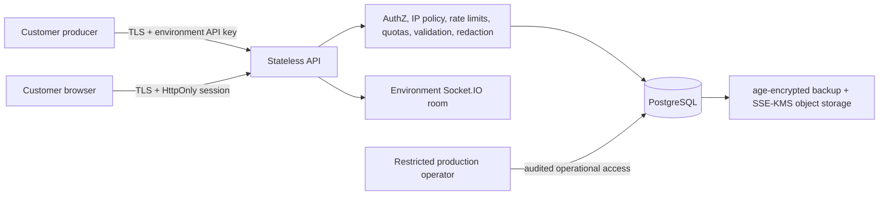

# Security and data-protection architecture

This document describes the controls implemented in Queue Monitor and their operational boundaries. It is not a claim of SOC 2, ISO 27001, HIPAA, PCI DSS, or GDPR certification. A customer contract, data-processing agreement, vendor review, evidence program, and legal review are still required before making compliance claims.

## Trust boundaries and tenant isolation

The hierarchy is `organization → project → environment`. Browser requests authenticate with a server-set session cookie; every telemetry query then resolves membership through the selected environment. Ingestion keys resolve to one environment and cannot choose a tenant in the request body. Event uniqueness, read filters, traces, metrics, live Socket.IO rooms, exports, and deletes all use that server-resolved environment or organization.

Customer data is stored in PostgreSQL: normalized event/query fields in relational columns, variable telemetry in JSONB, and identity/configuration in relational control-plane tables. Redis is used by the demo BullMQ workload; it is not the authoritative telemetry store. Backups contain PostgreSQL data and are protected as described in [operations.md](operations.md).

Application access is granted by the Owner/Admin/Developer/Viewer role matrix. Production database, backup, and secret-store access must be restricted to an approved on-call/operator group with MFA and periodic access review. The application does not expose raw password hashes, API-key hashes, session-token hashes, or backup keys.

## Authentication and sessions

- Passwords are hashed by PostgreSQL `crypt()` using Blowfish with cost 12.
- Login creates a new random session ID and signed JWT. Only a SHA-256 hash of the JWT is stored in `sessions`.
- The JWT is sent only in an `HttpOnly`, `SameSite=Lax` cookie. Production requires `Secure`.
- The API revalidates the session ID, user ID, token hash, expiry, and revocation state on every HTTP and Socket.IO authentication.
- Sessions expire after eight hours. Users can list/revoke sessions or log out every device.
- Role changes and password resets revoke all affected sessions, forcing re-authentication with current privileges.
- Password-reset tokens are random, single-use, stored only as hashes, expire after 30 minutes, and use a response that does not reveal whether an email exists.

`JWT_SECRET` must contain at least 32 random characters and live in a managed secret store. Rotate it with a planned global logout. SMTP credentials and reset/invitation URLs are environment configuration, never browser variables.

## Authorization

Owners administer the organization and roles. Owners/Admins manage projects, environments, security policy, data lifecycle, and exports. Owners/Admins/Developers manage environment API keys. Viewers have read-only telemetry access. The store repeats authorization in SQL instead of trusting route parameters.

When the last owner requests account deletion, the API returns `409` until ownership is transferred or the organization is deleted. This prevents orphaned tenants.

## API-key lifecycle

Keys are random `qmon_live_…` values, returned once, and persisted only as SHA-256 hashes with a non-secret prefix. They can expire and are revocable immediately. For zero-downtime rotation: create a replacement, deploy it to every producer, verify `last_used_at`, then revoke the old key. Never place keys in source code, browser variables, tickets, logs, or support messages.

## Ingestion protection

The ingestion request passes these controls before persistence:

1. API-key validation and environment binding.
2. Optional per-environment IPv4/IPv6 or CIDR allowlist (Business plan).
3. Monthly request, event, bandwidth, and retained-storage quotas.
4. PostgreSQL-backed token buckets for organization, environment, and API-key scopes, with configurable refill rates and burst multipliers.
5. Configurable request, batch, event, metadata, and nesting-depth limits.
6. Recursive PII/secret redaction and event-schema validation.
7. Environment-scoped, idempotent insertion.

Rate-limited/quota responses use `429`, a stable reason code, and `Retry-After`; IP denials use `403`. Attempts, accepted/stored events, bandwidth, retained storage, rate limits, and quota rejections are metered. Token buckets are transactional and shared by API replicas through PostgreSQL. At larger scale, move them to a low-latency distributed limiter while keeping PostgreSQL usage ledgers authoritative.

Defaults are `1 MiB` per request, `100` events per batch, `16 KiB` per event, `10 KiB` metadata, and `12` nested levels. Configure the first four runtime values with `MAX_REQUEST_BYTES`, `MAX_BATCH_SIZE`, `MAX_EVENT_BYTES`, and `MAX_NESTING_DEPTH`.

## PII detection and redaction

Before validation/storage, the API recursively redacts password/token/authorization/cookie/API-secret/card/CVV/SSN field names, Bearer/Basic credentials, Luhn-valid card numbers, and SSN-shaped values. Organization policy can additionally redact email addresses, phone numbers, and up to 50 custom field names. The public SDK should also redact at the source; server-side redaction is the last mandatory boundary.

Detection is deliberately conservative, but pattern detection is not a substitute for data minimization. Customers must not send request/response bodies, credentials, regulated health data, or payment authentication data. Existing plaintext cannot be fixed retroactively by enabling a rule; delete/export-review and reingest if an incident is discovered.

## Audit logs

`audit_logs` records time, actor, organization, IP, user agent, action, target, result, and safe metadata for login/logout, password reset, sessions, organization/project/environment creation, invitations, membership changes, API-key lifecycle, security settings, exports, and deletions. A database trigger rejects every `UPDATE` or `DELETE` against this table. IDs intentionally have no cascading foreign key so evidence survives customer/user deletion.

Audit metadata must never contain raw credentials, tokens, exported telemetry, or email addresses; email-related entries use a short hash. Application roles can only read organization audit records through the admin endpoint. Database administrators remain a privileged trust boundary and must be controlled/audited externally.

## HTTPS and browser security

Production sets `HTTPS_ENFORCE=true`, `TRUST_PROXY=true` only behind a trusted proxy, and `COOKIE_SECURE=true`. HTTP requests redirect with `308`; HTTPS responses include HSTS, CSP, X-Frame-Options, X-Content-Type-Options, Referrer-Policy, and Permissions-Policy. The web Nginx configuration adds a restrictive app CSP. Terminate TLS with TLS 1.2+ (prefer 1.3), managed certificates, and private TLS/verified connections to databases and object storage.

Do not enable HSTS on an HTTP-only local environment. Never trust arbitrary forwarded headers without a controlled load balancer.

## Retention, export, and deletion

Retention choices are 7, 30, 90, 180, or 365 days. The hourly retention job removes events older than each organization policy; a database trigger decrements current storage accounting. Audit logs are excluded from telemetry retention because they are security evidence. Define their contractual retention before production (recommended: at least one year, subject to legal requirements).

Authenticated admin exports contain organization/project/environment metadata, API-key metadata without secret/hash values, telemetry/traces, and audit records. JSON exports include every category; CSV is telemetry-oriented. The online export is capped at 50,000 events and returns `X-Export-Truncated: true` when an offline export is required. Treat exports as sensitive downloads and move large exports to expiring object-store links before broad production use.

Deletion endpoints cover telemetry, environments, projects, organizations, and user accounts, require explicit confirmation, and are audited. Relational cascades remove associated live data. Immutable audit records and already-created backups remain subject to their separate evidence/backup retention windows; deletion propagates when those encrypted backups expire rather than by mutating historical backup media.

## Secrets and logging

All credentials belong in environment configuration backed by a secret manager. `.env` and `infra/.env` are ignored; `VITE_*` is public and must never contain secrets. Logs include request and tenant identifiers but must not include request bodies, API keys, JWTs, cookies, reset/invitation tokens, database URLs, or SMTP credentials. CI runs a repository secret scan and dependency audit.

## Known security limitations

- No SSO/SAML, SCIM, MFA, customer-managed encryption keys, legal hold, or field-level database encryption yet.
- Rate limiting uses PostgreSQL and is appropriate for a small private beta, not internet-scale ingest.
- Audit immutability protects against application mutation, not a malicious database superuser; production needs independent database/cloud audit logs and export to append-only storage.
- Pattern-based PII detection can produce false negatives/positives. Add customer-specific tests and a classification program.
- The online exporter is synchronous and capped. Large exports need an asynchronous encrypted delivery workflow.
- Formal compliance evidence, penetration testing, threat modeling, vendor review, DPA/subprocessor records, and privacy/legal review remain required.

## Public demo workspace

The demo viewer is explicitly marked in `users.is_demo`; its signed session carries a server-verified demo claim. The API permits reads and logout/session cleanup but rejects all other cookie-authenticated mutation methods before route handling. The account has exactly one Viewer membership, Settings is hidden, and direct key/invitation/security/export requests are denied. The generator key is marked `api_keys.is_internal`, remains valid for ingestion, and is filtered from key listings and organization exports. Demo history still passes through normal API-key authentication, quotas, rate limiting, validation, PII redaction, storage accounting, and live publication.
